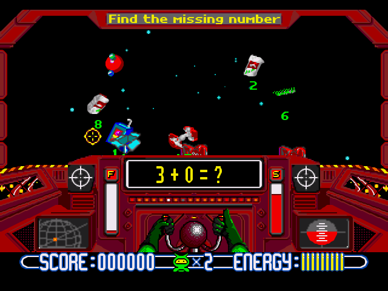
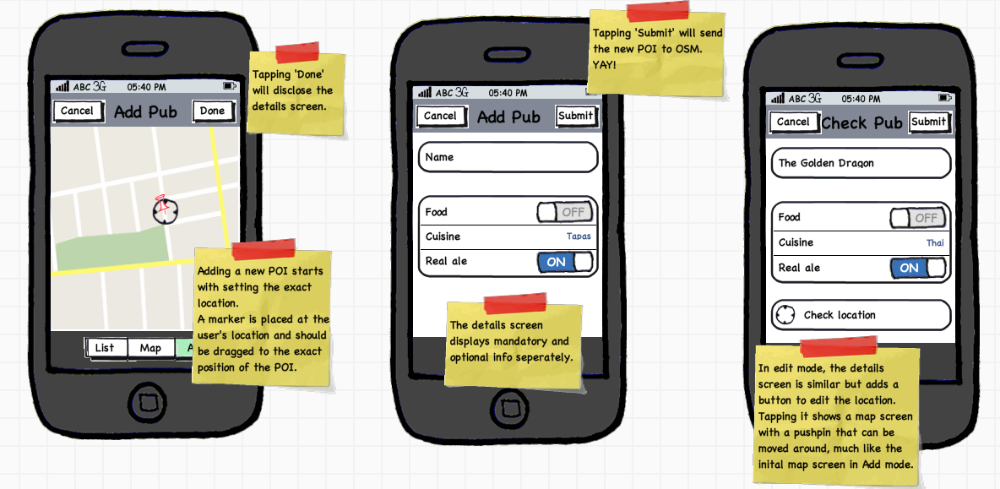
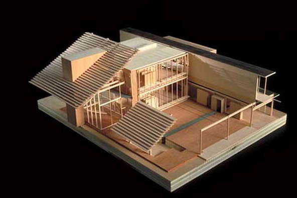
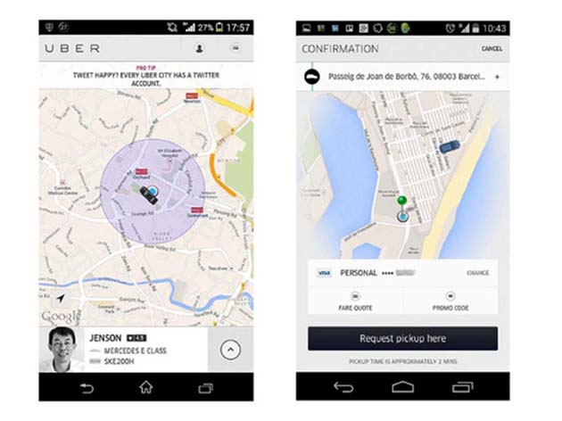

# Ορισμός

> Ο προγραμματισμός είναι ένας τρόπος σκέψης, όχι μια μηχανιστική δεξιότητα. Το ότι μάθεις τους βρόγχους ‘for’ δε σημαίνει πως μαθαίνεις να προγραμματίζεις, όπως δε σημαίνει πως μαθαίνεις να ζωγραφίζεις μαθαίνοντας για τα μολύβια.
- Bret Victor

## Ο ρόλος του προγραμματισμού της διάδρασης

Η διάδραση του ανθρώπου με υπολογιστές έχει καθιερωθεί στις περισσότερες ανθρώπινες δραστηριότητες, από την εργασία μέχρι την εκπαίδευση και τη διασκέδαση. Ο προγραμματισμός της διάδρασης που απαιτείται για την κατασκευή άρτιων συστημάτων είναι μια σύνθετη έννοια και μια διαδικασία που προϋποθέτει δεξιότητες τόσο τεχνολογικές όσο και ανθρωπιστικές. Για παράδειγμα, δεν αρκεί ένας κατασκευαστής να είναι ικανός προγραμματιστής, θα πρέπει να έχει και άριστη κατανόηση του ανθρώπινου παράγοντα αλλά και της διαδικασίας σχεδίασης (design). Αν και υπάρχουν πολλοί ικανοί κατασκευαστές συστημάτων, όπως και σχεδιαστές με γνώσεις ανθρωπιστικών επιστημών, για να λύσουμε ένα πρόβλημα από δυο οπτικές (μηχανή-άνθρωπος) χρειάζεται ο γόνιμος συνδυασμός τους. Η ενότητα αυτή ορίζει ποιος είναι αυτός ο γόνιμος συνδυασμός και γιατί είναι απαραίτητος στον προγραμματισμό διαδραστικών συστημάτων.

Πηγαίνοντας ένα βήμα ψηλότερα στην ανάλυση της χρησιμότητας του προγραμματισμού της διάδρασης, πέρα από την ανάγκη κατανόησης της λειτουργίας του σύγχρονου ψηφιακού κόσμου, διαπιστώνουμε ότι τόσο οι δεξιότητες που αναπτύσσονται όσο και τα αποτελέσματα του προγραμματισμού της διάδρασης δημιουργούν νέα προϊόντα και υπηρεσίες που επηρεάζουν τις προσωπικές αντιλήψεις, τις συνήθειες, τους θεσμούς και τις μορφές κοινωνικής οργάνωσης. Στην εποχή μας, που η χρήση του υπολογιστή έχει κατηγορηθεί για την αύξηση της ανεργίας μέσω του αυτοματισμού και της αύξησης της παραγωγικότητας, μπορούμε να δούμε με αισιοδοξία μια αχαρτογράφητη πτυχή του υπολογιστή ως μέσο και εργαλείο δημιουργίας ενός νέου επιπέδου ανθρώπινης δραστηριότητας.

## Ιστορικό και πολιτισμικό πλαίσιο της διάδρασης

Σε αυτό το μέρος θα μελετήσουμε την ιστορική εξέλιξη της σχεδίασης της διάδρασης ανθρώπου-συσκευών (Computer-Human Interaction Design). Το πιο σημαντικό συμπέρασμα που προκύπτει από πολλά ιστορικά παραδείγματα είναι ότι μόνο εκ του αποτελέσματος γίνεται κατανοητό γιατί κάποιες σχεδιάσεις είναι καλύτερες από άλλες. Ταυτόχρονα, παραμένει πάντα δύσκολο να προβλέψουμε και να σχεδιάσουμε με σιγουριά εκείνες τις μελλοντικές διαδράσεις ανθρώπου-υπολογιστών που είναι περισσότερο αποτελεσματικές. Αν και ο στόχος θα είναι πάντα φευγαλέος, στα επόμενα κεφάλαια θα δούμε ότι υπάρχουν θεωρίες, τεχνικές, οργανώσεις, διαδικασίες και εργαλεία κατασκευής που αργά ή γρήγορα μας δίνουν σταδιακά καλύτερες λύσεις. Σε κάθε περίπτωση, είναι σκόπιμο να ξέρουμε τι έχουν δοκιμάσει οι σχεδιαστές της διάδρασης στο παρελθόν και γιατί (α)πέτυχε.

Όπως είδαμε στα προηγούμενα, ο βασικός στόχος του προγραμματισμού της διάδρασης είναι να κατασκευάσει συστήματα και συσκευές που να ανταποκρίνονται στις ανάγκες των χρηστών (user needs) κατά τη διαδικασία επίτευξης των στόχων τους (user goals) σε ένα δεδομένο πλαίσιο χρήσης (context of use). Για αυτόν τον σκοπό, οι σχεδιαστές πρέπει να εξετάσουν παράγοντες όπως η ευχρηστία (usability) και η μέτρησή της (usability evaluation). Αν και η ευχρηστία είναι μια από τις βασικές αξίες της διάδρασης, δεν είναι η μόνη, ενώ η σημασία της μπορεί να είναι πολύ μικρή σε ορισμένες περιπτώσεις. Αν για παράδειγμα το σύστημα διάδρασης έχει εφαρμογή στην ψυχαγωγία (π.χ., εκπαιδευτικά βιντεο-παιχνίδια) τότε θέλουμε η διάδραση να προσφέρει εκτός από απλή ευχρηστία, ψυχαγωγία και μάθηση. Στην περίπτωση βελτίωσης ενός συστήματος που είτε προϋπάρχει είτε είναι παρόμοιο με υπάρχοντα συστήματα, τότε ο πιο απλός τρόπος από πλευράς κόστους, αποτελεσματικότητας (effectiveness) και ταχύτητας είναι να βασιστούμε σε επιτυχημένα ιστορικά παραδείγματα.

Τα ιστορικά παραδείγματα διάδρασης με συσκευές χρήστη έχουν σε ορισμένες περιπτώσεις κάποιες επικαλύψεις (χρονικές ή στα χαρακτηριστικά τους) όμως είναι όσο γίνεται περισσότερο ανεξάρτητα. Από τη μία πλευρά, η χρονολογική επισκόπηση είναι μια ενδιαφέρουσα ιστορική αναδρομή στην τεχνολογική εξέλιξη με έμφαση στη διάδραση, αλλά ταυτόχρονα είναι και μια εργαλειοθήκη για τον μελλοντικό σχεδιαστή της διάδρασης. Εστιάζουμε ειδικότερα στην εξέλιξη των διαδραστικών συστημάτων και στο πώς έχουν αυξήσει τη χρησιμότητα και την ευχρηστία των υπολογιστών.

Το πιο χαρακτηριστικό παράδειγμα διάδρασης είναι αυτό του επιτραπέζιου υπολογιστή και της γραφικής επιφάνειας εργασίας (Graphical User Interface - GUI), που ελέγχεται από τον χρήση με συσκευές εισόδου όπως το πληκτρολόγιο και το ποντίκι. Αυτή η μορφή υπολογιστή και διάδρασης είναι ενδιαφέρουσα γιατί ήταν η πρώτη μορφή υπολογιστή που ξέφυγε από τις μέχρι τότε πολύ εξειδικευμένες εφαρμογές των υπολογιστών (π.χ., βάσεις δεδομένων) και μπόρεσε να διευκολύνει τις εργασίες και την καθημερινότητα πάρα πολλών χρηστών (π.χ., με την επεξεργασία κειμένου, την ανάκτηση πληροφορίας από τον ιστό, και την επικοινωνία μέσω του ηλεκτρονικού ταχυδρομείου). Αν και το μοντέλο διάδρασης με τον επιτραπέζιο υπολογιστή δεν είναι ούτε τόσο δημοφιλές, ούτε τόσο εύκολο όσο αυτό του κινητού υπολογισμού (με τα έξυπνα κινητά και τις ταμπλέτες), έχει ιδιαίτερο ενδιαφέρον γιατί έχει μείνει σχετικά ίδιο από τότε που δημιουργήθηκε, πράγμα που επιβεβαιώνει ότι ανεξάρτητα από τη ραγδαία τεχνολογική εξέλιξη, η ανθρώπινη διάδραση κινείται σε πιο αργούς ρυθμούς.

## Ψηφιακός αλφαβητισμός, παραγωγικότητα και προσωπική έκφραση

Ο ψηφιακός αλφαβητισμός είναι καθολικά αποδεκτός ως μια πολύ βασική δεξιότητα ανεξάρτητα από τις προσωπικές και επαγγελματικές επιδιώξεις του κάθε ανθρώπου. Στις πρώτες φάσεις διάδοσης της διάδρασης με υπολογιστές, ο ψηφιακός αλφαβητισμός εξαντλήθηκε στην κατανόηση της χρήσης του υπολογιστή, αλλά τελικά έγινε σαφές ότι ο αλφαβητισμός εκτός από την ανάγνωση έχει ως αναγκαία προϋπόθεση και ένα βαθμό δεξιότητας στη συγγραφή. Φυσικά, όπως δεν έχουμε την απαίτηση από τον μέσο άνθρωπο να γράφει κείμενο όπως ένας κορυφαίος συγγραφέας, έτσι ακριβώς δεν έχουμε την απαίτηση να μπορεί να δημιουργήσει τα δικά του προγράμματα διάδρασης. Από την άλλη πλευρά, η δυνατότητα να παρέμβει στη δημιουργία και προσαρμογή προγραμμάτων διάδρασης που του ταιριάζουν είναι μια δεξιότητα που αυξάνει τις δυνατότητές του για έκφραση και δημιουργία, τόσο στην προσωπική όσο και στην επαγγελματική του ζωή.

### Ο άνθρωπος, ο υπολογιστής και η διάδρασή τους

O ένας πυλώνας του γνωστικού αντικειμένου του προγραμματισμού της διάδρασης είναι η επικοινωνία ανάμεσα σε έναν τουλάχιστον άνθρωπο και σε μία ή περισσότερες συσκευές. Ο δεύτερος πυλώνας είναι ο προγραμματισμός υπολογιστών. Σε αυτήν την ενότητα θα μελετήσουμε τα είδη της διάδρασης, τα στοιχεία που τη συνθέτουν, καθώς και το φυσικό, το κοινωνικό και το οργανωσιακό πλαίσιο μέσα στο οποίο μπορεί να συντελεστεί. Ακόμη, θα εξετάσουμε πόσο καλά μπορούν να υποστηρίξουν τις ανθρώπινες διαδικασίες τα διαφορετικά είδη της διάδρασης. Με αυτές τις γνώσεις σε αυτήν την ενότητα μπορούμε να μελετήσουμε πως ο άνθρωπος χρησιμοποιεί τις συσκευές κυρίως ως εργαλεία, αλλά και ως μέσα επικοινωνίας, ψυχαγωγίας και συνεργασίας.

Υπάρχουν πολλοί τρόποι διάδρασης του χρήστη με τη συσκευή. Αρχικά, έχουμε τη γραμμή εντολών και τις εντολές δέσμης (batch processing). Αυτοί ήταν και είναι πολύ αποτελεσματικοί τρόποι διάδρασης όταν ο χρήστης δίνει επαναλαμβανόμενες και σταθερές οδηγίες προς τη συσκευή. Αν όμως, από την άλλη, οι οδηγίες προς το σύστημα πρέπει να αλλάζουν συχνά,τότε έχουμε τον απευθείας χειρισμό (direct manipulation) και την εικονική πραγματικότητα (virtual reality - VR). Στην περίπτωση αυτή, όπου η διάδραση γίνεται δυναμικά, οι χρήστες λαμβάνουν συνέχεια ανάδραση (feedback). Στο ενδιάμεσο αυτών των ακραίων τύπων διάδρασης (γραμμή εντολής και απευθείας χειρισμός) υπάρχει ένα ολόκληρο φάσμα τύπων, μεταξύ των οποίων και τύποι διάδρασης που εμφανίζονται με τις κινητές εφαρμογές και τις συσκευές διάχυτου υπολογισμού (ubiquitous computing smart devices).

### Προσωπικές δεξιότητες

Με δεδομένη την ανάγκη ανάπτυξης δεξιοτήτων που θεμελιώνουν τον ψηφιακό αλφαβητισμό πέρα από την απλή χρήση -προς τη βαθύτερη κατανόηση λειτουργίας και ιδανικά τη δημιουργία νέων διαδράσεων- ένα ερώτημα που προκύπτει αφορά στην επιλογή του εργαλείου, την οργάνωση, αλλά και τη διαδικασία δημιουργίας της διάδρασης. Για να απαντήσουμε σε αυτό το ερώτημα θα πρέπει να ανατρέξουμε στη φύση του προγραμματισμού της διάδρασης. Το βασικό στοιχείο αυτής της περιοχής είναι ότι οι τελικές προδιαγραφές του συστήματος μάς είναι άγνωστες κατά το αρχικό στάδιο, ενώ είναι σίγουρο ότι ακόμη και αν έχουμε τις πρώτες εκδόσεις σε λειτουργικό επίπεδο, οι προδιαγραφές θα συνεχίζουν να προσαρμόζονται με τη χρήση και τη διαδικασία της επαναληπτικής αξιολόγησης (iterative evaluation process). Επομένως, τα κατάλληλα εργαλεία, οι διαδικασίες και οι δομές θα πρέπει να μπορούν να αλλάζουν γρήγορα, τόσο τα ίδια όσο και τα δημιουργήματά τους.

Σε πρώτη ανάγνωση, ο προγραμματισμός της διάδρασης φαίνεται το άθροισμα (ή ίσως η τομή) των επιμέρους περιοχών του προγραμματισμού υπολογιστή και της διάδρασης ανθρώπου-υπολογιστή. Στην πράξη όμως, η πρόσθεση των γνώσεων προγραμματισμού σε εκείνες τις διάδρασης ανθρώπου-υπολογιστή δεν είναι ικανή συνθήκη για τη δημιουργία νέων επινοήσεων ικανών να επαναπροσδιορίσουν ανθρώπινες και κοινωνικές δραστηριότητες. Αν και είναι σίγουρα αναγκαία συνθήκη να υπάρχουν οι βασικές επιμέρους γνώσεις, είτε στον ίδιο τον κατασκευαστή είτε στα μέλη μιας ομάδας συνεργασίας, υπάρχει επιπλέον η ανάγκη για γνώσεις σε ένα υψηλότερο επίπεδο - στο επίπεδο του προγραμματισμού της διάδρασης. Σε αυτό το υψηλότερο επίπεδο αφαίρεσης των επιμέρους λεπτομερειών, εστιάζουμε στα εργαλεία, στις δομές και στις διαδικασίες που θα δώσουν δημιουργικές λύσες σε υπάρχοντα προβλήματα, και κυρίως που θα επαυξήσουν τις δυνατότητές μας.

Όπως οι οπτικές γλώσσες προγραμματισμού υψηλού επιπέδου (π.χ., Scratch) έχουν μικρή μόνο σχέση με τις αντίστοιχες γλώσσες προγραμματισμού που είναι κοντά στη μηχανή (π.χ., Assembly, C), έτσι και ο προγραμματισμός της διάδρασης έχει μικρή μόνο σχέση με τις βασικές επιμέρους περιοχές του, όπως εκείνη του προγραμματισμού ΗΥ. Στην πράξη, ο προγραμματιστής της διάδρασης είναι χρήσιμο να ξέρει τις βασικές έννοιες του προγραμματισμού, όπως είναι η μεταβλητή και οι συνθήκες, αλλά από εκεί και πέρα η δεξιότητά του θα αυξηθεί περισσότερο αν μάθει να χρησιμοποιεί νέες βιβλιοθήκες και εργαλεία, παρά αν μάθει όλες τις λεπτομέρειες που κάνουν ένα πρόγραμμα υπολογιστή αποδοτικό (π.χ., ταχύτητα, μνήμη). Επομένως, αν και μιλάμε για προγραμματισμό της διάδρασης, στην πράξη ο προγραμματισμός αυτός, όπου υπάρχει, αφορά περισσότερο τη δημιουργική σύνθεση και χρήση έτοιμων βιβλιοθηκών και εργαλείων με απλές δομές ελέγχου, με τελικό σκοπό την επαύξηση των ανθρώπινων και κοινωνικών δραστηριοτήτων.

Οι βασικές τεχνολογίες και ο αντίστοιχος προγραμματισμός της δικτύωσης, της αποθήκευσης και της επεξεργασίας δεδομένων, και κυρίως της εισόδου και εξόδου πληροφορίας σε σχέση με τον άνθρωπο είναι δομικά στοιχεία του συστήματος. Επομένως, θέλουμε άμεση και εύκολη πρόσβαση σε όλα αυτά μαζί, χωρίς να πρέπει να ανησυχούμε για τις λεπτομέρειες της υλοποίησης (implementation). Αν και οι λεπτομέρειες της υλοποίησης θα έχουν μεγάλη σημασία όταν το σύστημά μας θα βρίσκεται στις ζωές πολλών ανθρώπων, σε αυτήν τη φάση της ανάπτυξης (κατά την οποία δεχόμαστε ότι δεν ξέρουμε τι ακριβώς ετοιμάζουμε, ούτε το πώς θα επηρεάσει την καθημερινότητα των ανθρώπων) είναι σκόπιμο να μην ασχοληθούμε με αυτές. Με αυτό το δεδομένο, η επιλογή των εργαλείων ανάπτυξης (ειδικά της γλώσσας προγραμματισμού και των βιβλιοθηκών) απλουστεύεται, αλλά σε καμία περίπτωση δεν μπορεί να χαρακτηριστεί εύκολη, πράγμα που θα δούμε στο αντίστοιχο κεφάλαιο των εργαλείων του προγραμματισμού της διάδρασης.

## Κατασκευή πρωτοτύπου και επανάληψη

Αν και υπάρχουν πάρα πολλές τεχνικές και μεθοδολογίες -και ακόμη περισσότερα εργαλεία και δομές- για τον προγραμματισμό της διάδρασης, αν έπρεπε να τα συνοψίσουμε όλα σε μια πρόταση, θα λέγαμε ότι: ο προγραμματισμός της διάδρασης είναι η επαναληπτική κατασκευή ενός πρωτοτύπου. Αυτή η επανατοποθέτηση του προβλήματος της κατασκευής μας επιτρέπει να στρέψουμε την προσοχή μας στη φύση και στον ρόλο του πρωτοτύπου ως ένα είδος ζωντανών και ευμετάβλητων προδιαγραφών ενός νέου συστήματος. Η διαδικασία κατασκευής του πρωτοτύπου είναι χρήσιμη ως μηχανισμός κατανόησης της διάδρασης που θέλουμε να υλοποιήσουμε, ενώ όταν το πρωτότυπο είναι σε μια πρώτη ικανοποιητική μορφή τότε μπορεί να χρησιμοποιηθεί για δοκιμές με τους τελικούς χρήστες ή ακόμη και να δημοσιευτεί ως αρχική έκδοση (π.χ., έκδοση άλφα, βήτα, από την ορολογία της τεχνολογίας λογισμικού). Αυτή η προσέγγιση είναι γνωστή στη βιβλιογραφία και ως “το πρωτότυπο ως προδιαγραφές”. Δηλαδή, αντί να ετοιμάσουμε ένα λεπτομερές συμβόλαιο που θα περιγράφει με λέξεις και διαγράμματα το αποτέλεσμα, έχουμε το ίδιο το αποτέλεσμα (εν τη γενέσει του) να δηλώνει τις ίδιες τις προδιαγραφές του. Αυτό είναι μια σχετικά απλή ιδέα που όμως φέρνει σε μεγάλη αντίθεση την περιοχή του προγραμματισμού της διάδρασης με τις συγγενείς περιοχές της επιστήμης των μηχανικών -ακόμη και με τη γονική περιοχή της τεχνολογίας λογισμικού- και αποδεικνύει τον κεντρικό ισχυρισμό αυτού του βιβλίου ότι ο προγραμματισμός της διάδρασης είναι μια νέα περιοχή που, ναι μεν έχει αρκετές ομοιότητες με άλλες, αλλά τελικά έχει τόσες διαφορές που απαιτούν ουσιαστικά διαφορετική αντιμετώπιση.

Το πρωτότυπο θα πρέπει να είναι διαδραστικό, διαφορετικά είναι σκόπιμο να το χαρακτηρίσουμε απλώς ένα αρχικό προσχέδιο. Τα αρχικά προσχέδια είναι και αυτά πολύ χρήσιμα, για την καλύτερη κατανόηση της διάδρασης, και κυρίως για την επικοινωνία μεταξύ των μελών της ομάδας ανάπτυξης. Τα αρχικά προσχέδια συνήθως έχουν τη μορφή του αφηγηματικού σεναρίου και των ενδεικτικών οθονών, αλλά υπάρχουν και άλλες επιλογές όπως το κόμικ (storyboard), το βίντεο, οι διαδραστικές διαφάνειες, και πολλά άλλα εξειδικευμένα εργαλεία κατασκευής προσχεδίου για το πρωτότυπο. Τα προσχέδια και τα πρωτότυπα κάθε άλλο παρά καινούρια είναι στην περιοχή των μηχανικών. Οι αρχιτέκτονες μηχανικοί ξεκινάνε τη σχεδίαση στο χαρτί, γιατί αυτός είναι παραδοσιακά ο πιο γρήγορος τρόπος αναπαράστασης μια ιδέας και βοηθάει τη σχεδιαστική σκέψη. Αντίστοιχα, ο προγραμματισμός της διάδρασης είναι σκόπιμο να ξεκινήσει από ένα σύντομο αφηγηματικό σενάριο, το οποίο θα συνοδεύεται από μερικές ενδεικτικές οθόνες. Παρά τις ομοιότητες με τους αρχιτέκτονες μηχανικούς, σημαντικές διαφορές στη μέθοδο προκύπτουν επειδή το αποτέλεσμα του προγραμματισμού της διάδρασης δεν είναι κάτι στέρεο και σταθερό, αλλά κάτι πολύ ρευστό, ευμετάβλητο, και φευγαλέο, που αλλάζει ανάλογα τη χρήση. Επιπλέον, τόσο τα προσχέδια όσο και τα πρωτότυπα θα πρέπει να αντικατοπτρίζουν την κίνηση που υπάρχει εκ των πραγμάτων σε μια διάδραση, κάτι που δύσκολα γίνεται στο χαρτί ή με απλές εικόνες. Για τον λόγο αυτό, στα προσχέδια του προγραμματισμού της διάδρασης θέλουμε να δημιουργήσουμε τουλάχιστον ένα σενάριο χρήσης και ενδεικτικές οθόνες, ώστε να μπορεί ο σχεδιαστής και οι άλλοι συμμετέχοντες της ομάδας να φανταστούν το τελικό προϊόν.

Οι διαφορές από τους αρχιτέκτονες μηχανικούς στην κατασκευή του πρωτοτύπου συνεχίζονται στην περίπτωση της μακέτας. Ενώ η μακέτα είναι για τους αρχιτέκτονες ένα προχωρημένο πρωτότυπο που αναπαριστά υπό κλίμακα σε τρεις διαστάσεις το μελλοντικό προϊόν, στον προγραμματισμό της διάδρασης ένα διαδραστικό πρωτότυπο είναι σχεδόν το ίδιο με το τελικό προϊόν. Η σημαντικότερη όμως διαφορά σε σχέση με τους αρχιτέκτονες και τις άλλες συγγενείς επιστήμες του μηχανικού είναι ότι ένα διαδραστικό πρωτότυπο, και φυσικά το τελικό προϊόν, δεν ακολουθούν καθόλου διακριτά στάδια κατά τις φάσεις της σχεδίασης, της παραγωγής και της βελτίωσης. Για παράδειγμα, η πρώτη εμπορική έκδοση του δημοφιλούς Apple iPhone δεν περιλάμβανε εφαρμογές άλλων παραγωγών λογισμικού, παρά μόνο τις επίσημες εφαρμογές της εταιρείας. Ήταν αυτό το 'τελικό προϊόν'ή μήπως ένα πολύ προχωρημένο 'πρωτότυπο'; Μπορεί από την πλευρά του υλικού η συσκευή να βελτιώθηκε σταδιακά, όμως από την πλευρά του λογισμικού, η νέα δυνατότητα του συστήματος να δέχεται πρόσθετες εφαρμογές δημιούργησε ουσιαστικά ένα καινούργιο προϊόν. Επομένως, θα μπορούσαμε να χαρακτηρίσουμε το πρώτο εμπορικό iPhone ως ένα προχωρημένο διαδραστικό πρωτότυπο των σύγχρονων iPhone, τα οποία δεν έχουν πάψει να εξελίσσονται. Σε συνδυασμό με το λογισμικό που διατίθεται από την ίδια την εταιρεία (στο οποίο συχνά συνεισφέρουν ανεξάρτητοι προγραμματιστές), νέο, εξωτερικό υλικό προστίθεται και διευκολύνει σημαντικές ανθρώπινες δραστηριότητες που έχουν να κάνουν με τις συναλλαγές, την υγεία, τη δημιουργία και τη διασκέδαση, παράγοντας ουσιαστικά ένα οικοσύστημα διάδρασης.

Συνοπτικά, η κεντρική διαφορά του προγραμματισμού της διάδρασης από άλλες επιστήμες του μηχανικού είναι ότι τόσο η διαδικασία ανάπτυξης όσο και η τελική κατασκευή αποτελούν στάδια ενός συνεχώς ανατροφοδοτούμενου κύκλου. Για παράδειγμα, η δημοφιλής υπηρεσία Google Mail για πολλά χρόνια είχε την ετικέτα βήτα (beta) ενώ ήταν πλήρως λειτουργική. Βλέπουμε λοιπόν, ότι στην περίπτωση του λογισμικού οι επίσημες 'τελικές' εκδόσεις είναι απλώς προφορικές ή γραπτές δηλώσεις και συμβάσεις του κατασκευαστή· σε αντίθεση με ένα σπίτι το οποίο, μετά την παράδοσή του στον χρήστη δέχεται ελάχιστες μετατροπές, ακόμη κι έπειτα από πολλά χρόνια. Το συμπέρασμα που αξίζει να μείνει είναι ότι η διαδικασία της κατασκευής στην περιοχή του προγραμματισμού της διάδρασης είναι ένας κύκλος επανάληψης στον οποίο δύσκολα θα προσδιορίσουμε πού αρχίζει και πού τελειώνει. Ειδικά για τα προϊόντα ευρείας χρήσης, είναι η ίδια η χρήση τους που επαναπροσδιορίζει τη φύση τους σε έναν αέναο κύκλο. Κάποιος θα μπορούσε να υποστηρίξει ότι όλα αυτά δεν είναι καθόλου νέα, και ότι όλες οι παραδοσιακές βιομηχανίες (κτήρια, αυτοκίνητα) σταδιακά μεταλλάσσονται για να εξυπηρετήσουν τους χρήστες τους. Αυτό είναι αλήθεια, αλλά οι αλλαγές που συνήθως συμβαίνουν σε όλες τις παραπάνω βιομηχανίες είναι τόσο σταδιακές χρονικά και τόσο προσθετικές δομικά, που και πάλι αναδεικνύεται αυτή η ιδιαιτερότητα του προγραμματισμού της διάδρασης ως προς τη διαδικασία κατασκευής, σε σχέση με τις πολύ συγγενείς του περιοχές.

## Η διάδραση ανθρώπου-υπολογιστή σε μεγαλύτερη κλίμακα

### Εργασία σε ομάδες

Μια πολύ σημαντική εφαρμογή των υπολογιστών έχει να κάνει με τη διευκόλυνση της επικοινωνίας και της συνεργασίας μικρών ομάδων ανθρώπων. Για να κατασκευάσουμε ένα σύστημα που θα υποστηρίζει την εργασία σε ομάδες, θα πρέπει να κατανοήσουμε τον ρόλο του κάθε μέλους της ομάδας στις κοινές διεργασίες. Αν και η σημασία της κοινωνικής διάστασης της συνεργασίας ήταν ήδη γνωστή σε συναφείς ερευνητικές περιοχές όπως τα πληροφοριακά συστήματα διοίκησης (Management Information Systems) και η οργανωσιακή συμπεριφορά, η εξειδικευμένη περιοχή των κοινωνικών και συνεργατικών συστημάτων (Social & Collaborative Systems) δημιουργήθηκε στα τέλη της δεκαετίας του 1980. Αρχικά, οι ερευνητές ασχολήθηκαν με τις ανάγκες που προκύπτουν κατά τη συνεργασία στον χώρο της εργασίας με επιτραπέζιους υπολογιστές και ενσύρματα δίκτυα. Όμως πολύ γρήγορα, το ενδιαφέρον τους στράφηκε προς τον κινητό υπολογισμό, τα κοινωνικά δίκτυα, και τα δικτυακά βιντεο-παιχνίδια ρόλων. Τέλος, πρέπει να τονιστεί ότι οι εφαρμογές αυτής της περιοχής δεν περιορίζονται πλέον στο πεδίο της εργασίας, αλλά έχουν επεκταθεί σε πολλά ακόμη σημαντικά πεδία κοινωνικής δραστηριότητας, όπως αυτό της εκπαίδευσης.

Η θεωρία για τη διάδραση ανθρώπου-υπολογιστή εμφανίζεται με διαφορετικές μορφές σε πολλές διαφορετικές περιοχές, οι οποίες έχουν σχετικά διαφορετικούς στόχους (goals, objectives). Για παράδειγμα, η Εργονομία έχει εστιάσει κυρίως στις σωματικές εργασίες των ανθρώπων που δουλεύουν με βιομηχανικές μηχανές ή ρομπότ, στην είσοδο δεδομένων και στον χειρισμό εξοπλισμού ασφαλείας (π.χ., σε αεροσκάφη και πλοία, σε συστήματα ενέργειας, κτλ.). Από την άλλη πλευρά, η περιοχή των Πληροφοριακών Συστημάτων Διοίκησης λειτουργεί σε μεγαλύτερη κλίμακα, εκεί όπου πολλοί άνθρωποι συνεργάζονται ως μέλη επιμέρους ομάδων για να πάρουν αποφάσεις και να πετύχουν κοινούς στόχους, στα πλαίσια ενός ή περισσότερων διασυνδεδεμένων οργανισμών και ιεραρχικών δομών αποφάσεων. Ανάμεσα στα δύο άκρα της κλίμακας της διάδρασης (άνθρωπος-υπολογιστής και οργανισμός που συντονίζει ομάδες ανθρώπων) βρίσκεται η σχετικά νεότερη περιοχή των Κοινωνικών και Συνεργατικών Συστημάτων. Εκεί η διάδραση συμβαίνει ανάμεσα στα μέλη μιας μικρής ομάδας ανθρώπων, η οποία συντονίζεται με τη βοήθεια υπολογιστών. Φυσικά, ο διαχωρισμός ανάμεσα στις παραπάνω περιοχές δεν είναι στεγανός και παρατηρούνται αρκετές επικαλύψεις, όπως για παράδειγμα σε θέματα ιδιωτικότητας.

### Το λογισμικό διάδρασης ως υπηρεσία και αγαθό

Το λειτουργικό σύστημα των επιτραπέζιων υπολογιστών αρχικά ήταν προς πώληση ως προϊόν, συσκευασμένο σε κουτί. Όμως σταδιακά, έγινε αντιληπτό ότι το περιεχόμενο του κουτιού ποτέ δεν ήταν το τελικό, αφού λίγες μέρες μετά τη συσκευασία και διανομή του, γίνονταν ήδη βελτιώσεις στον πηγαίο κώδικα. Η ανάπτυξη του διαδικτύου ως κανάλι διανομής επέτρεψε στο λογισμικό να βρει τον χαρακτήρα που του ταιριάζει περισσότερο, ως υπηρεσία (αν και υπάρχει μια υβριδική ισορροπία ανάμεσα στα δύο όταν το λογισμικό συνοδεύει κάποια συσκευή). Διαπιστώνουμε ότι το λογισμικό είναι αρκετά διαφορετικό από άλλα προϊόντα και υπηρεσίες αναφορικά με τις παρακάτω ιδιότητες: α) την πνευματική ιδιοκτησία, β) την εμπορευσιμότητα, τις οποίες μελετάμε στα επόμενα.

Υπάρχουν πολλά είδη δικαιωμάτων πνευματικής ιδιοκτησίας, όπως το εμπορικό σήμα (trademark), η πατέντα (patent), η πνευματική ιδιοκτησία (copyright). Τα περισσότερα έργα λογισμικού αντιμετωπίζονται όπως τα λογοτεχνικά βιβλία και έχουν πνευματική ιδιοκτησία, αν και υπάρχουν περιπτώσεις στο λογισμικό της διεπαφής ανθρώπου-υπολογιστή όπου έχει γίνει προσπάθεια για πατέντα. Για παράδειγμα, στα τέλη της δεκαετίας του 1980 η Apple προσπάθησε να προστατεύσει το Γραφικό Περιβάλλον Εργασίας (Graphical User Interface - GUI) απέναντι στον ανταγωνισμό της Microsoft. Επειδή το λογισμικό δεν είναι ούτε βιβλίο αλλά ούτε και βιομηχανικό αντικείμενο, τα υπάρχοντα είδη πνευματικής ιδιοκτησίας ίσως να μην του ταιριάζουν. Άλλωστε αυξάνονται οι περιπτώσεις όπου το λογισμικό δίνεται με άδεια ανοικτού κώδικα (open source license) ή παρέχει κάποια Διεπαφή Προγραμματισμού Εφαρμογών (API, από το Application Programming Interface) και στη συνέχεια ο δημιουργός αναζητεί αμοιβή μέσα από την πώληση της τεχνογνωσίας του. Όσο χαρακτηριστική είναι η περίπτωση αυτοδημιούργητων τύπου 'κλειστού κώδικα' όπως ο Bill Gates της Microsoft, άλλο τόσο ενδιαφέρουσα είναι η περίπτωση του Linus Torvalds, με τα ανοικτού κώδικα Linux, ο οποίος επέλεξε να δώσει δωρεάν τον καρπό της προσπάθειάς του. Και στις δύο περιπτώσεις είχαμε τη δημιουργία μιας πολύ μεγάλης βιομηχανίας και πολλών θέσεων εργασίας, παρόλο που η προσέγγιση του καθενός ήταν αντιδιαμετρικά αντίθετη.

Η εμπορευσιμότητα ενός αγαθού ή υπηρεσίας εξαρτάται από πολλούς παράγοντες, αλλά ο σημαντικότερος είναι η δυνατότητα που υπάρχει για εύκολη γεωγραφική διανομή. Το λογισμικό, που ξεκίνησε ως μέρος του υλικού και στη συνέχεια έγινε δίσκος που αγοραζόταν από τα ράφια του λιανεμπορίου, τον τελευταίο καιρό έχει μετατραπεί σε υπηρεσία διαθέσιμη στο διαδίκτυο. Στην ίδια συζήτηση έχει ενδιαφέρον να αναφερθούμε και στη δουλειά του προγραμματιστή λογισμικού, στις δυνατότητες καθώς και στους κινδύνους από την εμπορευσιμότητα αυτής της εργασίας. Για παράδειγμα, μια υπηρεσία στο Web είναι διαθέσιμη παντού, πράγμα που σημαίνει ότι τελικά θα πρέπει να ανταγωνιστεί αντίστοιχες προσπάθειες από όπου και αν προέρχονται, είτε από τις τεχνολογικά ανεπτυγμένες χώρες είτε από τις χώρες με το εξειδικευμένο εργατικό δυναμικού χαμηλού κόστους. Πέρα από τις ευκαιρίες για μια διευρυμένη αγορά, μέσα σε αυτό το παγκοσμιοποιημένο πλαίσιο επαγγελματικής δραστηριότητας είναι μάλλον αφελές να κρατάμε κλειστή τη διεπαφή με ένα λογισμικό, αφού μέσα σε μικρό σχετικά χρονικό διάστημα κάποιος μπορεί να φτιάξει κάτι παρόμοιο ή κάτι καλύτερο. Μια περισσότερο αποτελεσματική στρατηγική είναι να κάνουμε διαθέσιμο τον πηγαίο κώδικα (ελπίζοντας σε συνεισφορές για τη βελτίωσή του) και ταυτόχρονα να μαθαίνουμε από τις διαδράσεις που κάνουν οι χρήστες. Έτσι, θα βελτιώνουμε την υπηρεσία, και κυρίως θα αυξάνουμε τη γνώση που έχουμε για το τι συνιστά ανά πάσα στιγμή μια χρήσιμη και επιθυμητή υπηρεσία, που είναι και το ζητούμενο για ένα σχετικά βιώσιμο ανταγωνιστικό πλεονέκτημα.

Από την άλλη πλευρά, το λογισμικό λειτουργεί παρόμοια με τη μηχανή εσωτερικής καύσης και τη βιομηχανική ρομποτική αναφορικά με την αυτοματοποίηση της ανθρώπινης δραστηριότητας. Η αυτοματοποίηση συνήθως θεωρείται αρετή, αφού επιτρέπει στον άνθρωπο να ασχοληθεί με κάτι άλλο από τις μηχανικές, επίπονες και επαναλαμβανόμενες διεργασίες. Στην πράξη επέτρεψε τη μετάβαση από την αγροτική στη βιομηχανική εποχή και έπειτα στην εποχή των υπηρεσιών. Η άλλη όψη του νομίσματος, όμως, περιγράφει μια επίπονη περίοδο μετάβασης από τη μια εποχή στην επόμενη. Όπως οι μηχανές εσωτερικής καύσης διευκόλυναν την εργασία και αύξησαν την παραγωγικότητα κατά τη μετάβαση από την αγροτική στη βιομηχανική εποχή, όπως η ρομποτική και ο αυτοματισμός μείωσαν στη συνέχεια την ανάγκη για ανθρώπινη εργασία στα εργοστάσια, με τον ίδιο τρόπο το λογισμικό διάδρασης έρχεται να αυτοματοποιήσει πάρα πολλές εργασίες που γίνονταν με τη μεσολάβηση ανθρώπων στη βιομηχανία των υπηρεσιών (π.χ., τράπεζες, ασφάλειες, ταξίδια, κτλ.). Αν η ιστορία είναι σωστός οδηγός, τότε θα πρέπει να αναζητήσουμε την επόμενη βιομηχανική επανάσταση ανάμεσα στις δυνατότητες που μας προσφέρει ο προγραμματισμός της διάδρασης για νέες υπηρεσίες και αγαθά, τα οποία με τη σειρά τους θα ορίσουν μια νέα αγορά.

## Ψηφιακή οικονομία

Σε αυτήν την ενότητα περιγράφουμε τις ιδιότητες που παρουσιάζει μια γενιά επιχειρήσεων και οργανισμών που προσπαθούν να μεγιστοποιήσουν τους δεσμούς τους με άλλους συγγενείς οργανισμούς. Το όραμά τους στηρίζεται σε μια διαφορετική φιλοσοφία για την ιδιοκτησία και την αξία, ενώ ο ακρογωνιαίος λίθος για αυτό το οικοδόμημα είναι ο προγραμματισμός της διεπαφής του προγραμματιστή, ο οποίος αποτελεί ειδική περίπτωση του προγραμματισμού της διάδρασης με αποδέκτη έναν χρήστη -τον προγραμματιστή.

Στη βιομηχανική εποχή (19ος αιώνας), όταν οι μηχανές αντικατέστησαν το μεγαλύτερος μέρος της ανθρώπινης χειρωνακτικής εργασίας, σε πρώτη φάση δημιούργησαν στρατιές ανέργων, σε δεύτερη φάση όμως, τα προϊόντα ορισμένων δημιουργικών ανθρώπων που βασίστηκαν στις μηχανές (π.χ., αεροπλάνο, αυτοκίνητο κ.ά.) δημιούργησαν νέους κλάδους εργασίας και ανθρώπινης δραστηριότητας αθροιστικά πολύ μεγαλύτερους από αυτούς που αρχικά κατέστρεψαν. Για παράδειγμα, τόσο η βιομηχανία του τουρισμού όσο και αύξηση της οικονομικής δραστηριότητας με τη συγκέντρωση των ανθρώπων στις πόλεις, ήταν παράπλευρες ωφέλειες του αεροπλάνου και του αυτοκινήτου.

Είναι αλήθεια ότι το πρώτο κύμα διάχυσης του ΗΥ, με πρωταγωνιστή τον επιτραπέζιο ΗΥ, κατάφερε να αυτοματοποιήσει πολύ μεγάλο μέρος της εργασίας γραφείου, με αποτέλεσμα την απώλεια θέσεων εργασίας στον πυρήνα της οικονομίας των υπηρεσιών. Σε αναλογία με τη βιομηχανική εποχή, η ενσωμάτωση και η διάχυση του ΗΥ στην καθημερινότητα με νέα προϊόντα και υπηρεσίες ενδέχεται να δημιουργήσει αθροιστικά περισσότερες θέσεις εργασίας από εκείνες που χάθηκαν, αρκεί να βρεθούν οι δημιουργικοί και καταρτισμένοι προγραμματιστές της διάδρασης που θα φανταστούν και θα υλοποιήσουν αυτούς τους νέους κλάδους ανθρώπινης δραστηριότητας.

Ο προγραμματισμός της διάδρασης δεν είναι πανάκεια και σίγουρα δεν είναι λύση σε σημαντικά προβλήματα που έχουν να κάνουν με τη φτώχεια, την υγεία, και την εκπαίδευση. Από την άλλη πλευρά, ο προγραμματισμός της διάδρασης είναι σίγουρα μια λύση συμβατή με την πολύ σημαντική ανάγκη που αφορά στη δυνατότητά μας να φανταστούμε και να δημιουργήσουμε ένα διαφορετικό και νέο επίπεδο ανθρώπινης δραστηριότητας σε σημαντικούς τομείς όπως η εργασία, η ψυχαγωγία, η ευζωία ή η εκπαίδευση. Τέλος, είναι σίγουρα μία από τις λίγες λύσεις που έχουμε για να θέσουμε σε λειτουργία τον εκδημοκρατισμό των ψηφιακών μέσων σχεδίασης και παραγωγής, τα οποία έχουν τη δυνατότητα να περάσουν την οικονομία στο επόμενο στάδιο, στην εποχή μετά τη βιομηχανία των υπηρεσιών γραφείου.

## Εμπορική μελέτη περίπτωσης

Πριν ο προγραμματισμός της διάδρασης αποκτήσει πρωταγωνιστικό ρόλο στην έρευνα και στη βιομηχανία, η επιτυχία ενός προϊόντος μπορούσε να μετρηθεί από τις πωλήσεις που έκανε ή από τις καλές κριτικές που έπαιρνε. Η άνοδος του προγραμματισμού της διάδρασης προσθέτει νέες μετρικές, όπως τη συμμετοχή των χρηστών στην επέκταση του αρχικού προϊόντος. Στον χώρο της ψυχαγωγίας μέσω υπολογιστή, μία από τις πιο επιτυχημένες περιπτώσεις είναι αυτή του Minecraft, στο οποίο οι χρήστες-παίκτες είναι εκείνοι που κατασκευάζουν από κοινού το περιβάλλον του παιχνιδιού.

Η έμφαση στην κατασκευή του εικονικού κόσμου του παιχνιδιού από τους τελικούς χρήστες βασίζεται σε μια συμμετοχική φιλοσοφία που είναι εντελώς διαφορετική από την παροχή μιας προκατασκευασμένης εμπειρίας, όπως είναι το σύνηθες στα περισσότερα βιντεο-παιχνίδια. Οι δημιουργοί του Minecraft ανάγνωσαν έγκαιρα την ανάγκη των χρηστών για μεγαλύτερη δυνατότητα προσωπικής έκφρασης μέσα από τις ψηφιακές δραστηριότητές τους. Εκτός από τη συμμετοχή των χρηστών στην κατασκευή του εικονικού κόσμου του παιχνιδιού, οι κατασκευαστές του Minecraft έχουν προχωρήσει ένα βήμα παρακάτω, στη διευκόλυνση της ανάπτυξης επεκτάσεων (Modifications ή Mods) που αλλάζουν τη συμπεριφορά του παιχνιδιού ή προσθέτουν λειτουργίες. Μία από τις πιο ενδιαφέρουσες λειτουργίες προσθέτει τη δυνατότητα της εκμάθησης προγραμματισμού για τον υπολογιστή. Με δεδομένη την εμβύθιση (immersion) των χρηστών στο σύστημα διάδρασης του Minecraft, η ελπίδα είναι ότι η εκμάθηση του προγραμματισμού υπολογιστών μπορεί να κινητοποιηθεί από το ίδιο το μέσο, με σκοπό την κατασκευή νέων συμπεριφορών για τον κόσμο του Minecraft.

Η ενεργή συμμετοχή των χρηστών στην κατασκευή παιχνιδιών δεν είναι κάτι νέο, ούτε ήταν το Minecraft η πρώτη ανάλογη περίπτωση. Στις αρχές της δεκαετίας του 1990 η δημοφιλής σειρά βιντεο-παιχνιδιών Doom έδινε τη δυνατότητα στους χρήστες να κατασκευάσουν τις δικές του πίστες, πράγμα που διατηρούσε το ενδιαφέρον τους για περισσότερο καιρό. Στη δυνατότητα mods του Minecraft, και ειδικά στην ευελιξία που δίνει για να εξυπηρετήσει διαφορετικούς σκοπούς, βλέπουμε τη διαφορετική φιλοσοφία απέναντι στην ιδιοκτησία που έχουν οι εταιρείες του διαδικτύου σε σχέση με τις παλιότερες εταιρείες κατασκευής παιχνιδιών, οι οποίες ήθελαν να έχουν όσο γίνεται μεγαλύτερο έλεγχο τόσο στους χαρακτήρες όσο και στο εικονικό περιβάλλον του παιχνιδιού, ενώ πολλές φορές είχαν κάνει την πρόσβαση στα βιντεο-παιχνίδια τους δύσκολη σε μια προσπάθεια να αποτρέψουν την παράνομη αντιγραφή.

Η ίδια η ιστορία της ανάπτυξης του Minecraft έχει ιδιαίτερο ενδιαφέρον και πέρα από τη φύση της διάδρασης, η οποία όπως είδαμε παραπάνω βασίζεται στη συμμετοχή των χρηστών τόσο στο περιεχόμενο του παιχνιδιού όσο και στην επέκταση της ίδιας της συμπεριφοράς του με τροποποιήσεις (modifications ή mods). Η αρχική ανάπτυξη του παιχνιδιού έγινε από έναν μόνο έμπειρο κατασκευαστή, ο οποίος άφησε τη θέση υπαλλήλου που είχε σε εταιρεία ανάπτυξης βιντεο-παιχνιδιών για να υλοποιήσει τις δικές του ιδέες. Η έμπνευση ήρθε από την ενασχόληση του με βιντεο-παιχνίδια από μικρούς ανεξάρτητους παραγωγούς, οπότε δημιουργήθηκε η πρώτη έκδοση ενός παιχνιδιού όπου ο χρήστης μπορούσε να τοποθετήσει και αντικείμενα σε χώρο τριών διαστάσεων. Στη συνέχεια πρόσθεσε τη δυνατότητα κατασκευής από πολλούς χρήστες καθώς και από 'εχθρούς' τους. Από εκεί και πέρα, η δημοσιότητα ήρθε από μόνη της, όταν οι χρήστες του παιχνιδιού άρχισαν να δημιουργούν όμορφες κατασκευές. Βλέπουμε, λοιπόν, ότι η προσωπική έκφραση μέσω του υπολογιστή στην περίπτωση του Minecraft δεν είναι μόνο ένα προνόμιο του δημιουργού του αλλά και όλων των τελικών χρηστών, που έτσι νιώθουν το παιχνίδι δικό τους.

## Ερευνητική μελέτη περίπτωσης

Η γραφική επιφάνεια εργασίας όπως είναι διαθέσιμη σε πολλούς εμπορικούς επιτραπέζιους υπολογιστές λίγο διαφέρει από εκείνη που είχε ο υπολογιστής Xerox Star που δημιουργήθηκε στο ερευνητικό κέντρο PARC. Η γραφική επιφάνεια εργασίας σε συνδυασμό με το ποντίκι και το πληκτρολόγιο αποτελεί ένα ιδιαίτερα αποδοτικό τρόπο εργασίας με επεξεργαστές κειμένου, φύλλα εργασίας, και προγράμματα επεξεργασίας εικόνας και γραφικών. Δεν είναι τυχαίο ότι η δημιουργία της γραφικής επιφάνειας εργασίας έγινε από το ερευνητικό κέντρο PARC της εταιρείας XEROX κατά την διάρκεια μελέτης και αυτοματοποίησης της εργασίας σε εκδοτικούς οργανισμούς. Αξίζει να δούμε λίγο πιο προσεκτικά τα χαρακτηριστικά του Star γιατί θα καταλάβουμε καλύτερα τους λόγους που η γραφική επιφάνεια εργασίας πήρε αυτήν τη μορφή και όχι κάποια άλλη η οποία θα ήταν αποδεκτή αν το πλαίσιο ανάπτυξης και οι ανάγκες των χρηστών ήταν διαφορετικές.

Τα βασικά συστατικά της γραφικής επιφάνειας εργασίας υπήρχαν από προηγούμενες ερευνητικές και εμπορικές προσπάθειες (π.χ., ποντίκι, ηλεκτρονική επεξεργασία κειμένου σε οθόνη), αλλά ήταν το Xerox Star ο πρώτος υπολογιστής που ολοκλήρωνε τις κατακερματισμένες προσπάθειες σε μια χρήσιμη και εύχρηστη συσκευή. Η κινητήριος δύναμη αυτής της δημιουργικής και ολοκληρωμένης σύνθεσης ήταν η ανθρωποκεντρική σχεδίαση και ανάπτυξη του συστήματος Star με έμφαση στις ανάγκες ενός πελάτη, ενός εκδοτικού οίκου που έκανε γλωσσική επιμέλεια και σελιδοποίηση εγγράφων και βιβλίων. Για τον σκοπό αυτό, οι ερευνητές έκαναν παρατήρηση (observation) του τρόπου εργασίας σε ένα γραφείο της εποχής που διαχειριζόταν έγγραφα. Με αυτόν τον τρόπο διαπίστωσαν ότι υπήρχε ανάγκη για εύκολη επεξεργασία και αποθήκευση ενός εγγράφου που περιείχε πολυμεσικά στοιχεία, καθώς και για τον διαμοιρασμό του. Οι παραπάνω προδιαγραφές που προέκυψαν από τις ανάγκες των χρηστών σε συνδυασμό με το πλαίσιο χρήσης (γραφείο εκδοτικού οργανισμού) οδήγησαν στη δημιουργία της γραφικής επιφάνειας εργασίας.

Η γραφική επιφάνεια εργασίας είναι μια συμπαγής και συνεπής σύνθεση από επιμέρους στοιχεία διάδρασης. Συνήθως αναφέρεται και ως μοντέλο 'Windows Icons Menus Pointer' (WIMP), καθώς τα βασικά της στοιχεία είναι τα παράθυρα, τα εικονίδια, τα μενού και ο δείκτης. Τα παράθυρα αντιπροσωπεύουν έγγραφα της ίδιας ή άλλων εφαρμογών, τα εικονίδια αντιπροσωπεύουν εφαρμογές, φακέλους και αρχεία, ενώ τα μενού επιτρέπουν ενέργειες πάνω σε αντικείμενα ή αλλαγή της κατάστασης μιας εφαρμογής. Ο δείκτης επιτρέπει την πλοήγηση (navigation) ανάμεσα σε παράθυρα, εικονίδια και μενού, καθώς και την επιλογή αντικειμένων. Ο δείκτης συνήθως ελέγχεται από ένα ποντίκι, αλλά αυτό δεν είναι η μόνη πιθανή συσκευή εισόδου, αφού ένας δείκτης μπορεί επίσης να ελέγχεται από διαφορετικές συσκευές εισόδου όπως είναι η πένα ή ακόμη και απευθείας με την αφή. Σε κάθε περίπτωση αυτό που είναι σημαντικό στη γραφική επιφάνεια εργασίας είναι να έχουμε απευθείας χειρισμό των στοιχείων της από τον δείκτη. Τα παραπάνω χαρακτηριστικά τα συναντάμε με διαφορετική αισθητική και μικρές παραλλαγές σε εναλλακτικά λειτουργικά συστήματα με γραφική επιφάνεια εργασίας.

Βλέπουμε λοιπόν, ότι αυτό που ονομάζουμε γραφική επιφάνεια εργασίας είναι το αποτέλεσμα της δημιουργικής ολοκλήρωσης ενός συνόλου από προηγούμενες τεχνολογίες, για την εξυπηρέτηση των αναγκών μιας δεδομένης ομάδας χρηστών. Έχοντας αναλύσει παραπάνω τη γραφική επιφάνεια εργασίας από την πλευρά των χρηστών, οι οποίοι ήταν εργαζόμενοι γραφείου (κυρίως εκδοτικών οίκων ή συναφών οργανισμών), θα αναλύσουμε επίσης την πλευρά της τεχνολογίας, η οποία είχε βασιστεί σε προηγούμενα έργα. Ανάμεσα στις πολλές επιρροές του Xerox Star, η σημαντικότερη ήταν η υιοθέτηση της συσκευής εισόδου ποντίκι, και κυρίως ο τρόπος με τον οποίο ο δείκτης του ποντικιού επέτρεπε τη διάδραση με μια αφαιρετική αναπαράσταση της πληροφορίας σε μια οθόνη. Η σημασία αυτής της τεχνολογικής καινοτομίας μπορεί να γίνει κατανοητή αν αναλογιστούμε ότι μέχρι τότε η χρήση του υπολογιστή βασιζόταν στη στενή σύνδεση της εισόδου με την έξοδο για τον χρήστη, αφού για παράδειγμα είχαμε κείμενο σε οθόνη κειμένου, τα οποία διαχειριζόμασταν μόνο με το πληκτρολόγιο, χωρίς να υπάρχουν ενδιάμεσα επίπεδα αφαιρετικότητας του είδους της πληροφορίας. Από τα παραπάνω κατανοούμε ότι, τελικά, η συνεισφορά του υπολογιστή Star ήταν πολύ μεγαλύτερη από την αλλαγή του τρόπου που κάνουμε αυτό που λέμε δουλειά γραφείου, αφού η ιστορία ανάπτυξής του δείχνει τη μέθοδο, τα εργαλεία και τους κανόνες, για να σχεδιάσουμε και να κατασκευάσουμε νέους τρόπους διάδρασης με τον υπολογιστή.

## Σχετική βιβλιογραφία

Beaudouin-Lafon, M. (2004, May). Designing interaction, not interfaces. In Proceedings of the working conference on Advanced visual interfaces (pp. 15-22). ACM.

Bolter, J.D., Grusin, R. (2000). Remediation: Understanding New Media. The MIT Press.

Deterding, S., Dixon, D., Khaled, R., & Nacke, L. (2011, September). From game design elements to gamefulness: defining gamification. In Proceedings of the 15th International Academic MindTrek Conference: Envisioning Future Media Environments (pp. 9-15). ACM.

Graham, P. (2004). Hackers and Painters: Big Ideas from the Computer Age. O'Reilly Media

Johnson, J., Roberts, T. L., Verplank, W., Smith, D. C., Irby, C. H., Beard, M., & Mackey, K. (1989). The xerox star: A retrospective. Computer, 22(9), 11-26.

Lanier, J. (2014). Who owns the future?. Simon and Schuster.

Malone, T. W. (1982, March). Heuristics for designing enjoyable user interfaces: Lessons from computer games. In Proceedings of the 1982 conference on Human factors in computing systems (pp. 63-68). ACM.

Noble, J. (2012). Programming Interactivity. O'Reilly.

Reas, C., & Fry, B. (2007). Processing: a programming handbook for visual designers and artists (Vol. 6812). Mit Press.

Samuelson, P., Davis, R., Kapor, M. D., & Reichman, J. H. (1994). A manifesto concerning the legal protection of computer programs. Columbia Law Review, 2308-2431.

Scott Rosenberg (2008). Dreaming in Code: Two Dozen Programmers, Three Years, 4,732 Bugs, and One Quest for Transcendent Software. Three Rivers Press

Thimbleby, H. (2008). Press On:Principles of Interaction Programming. MIT Press

Victor, B. (2012). [Learnable Programming](http://worrydream.com/LearnableProgramming/)
