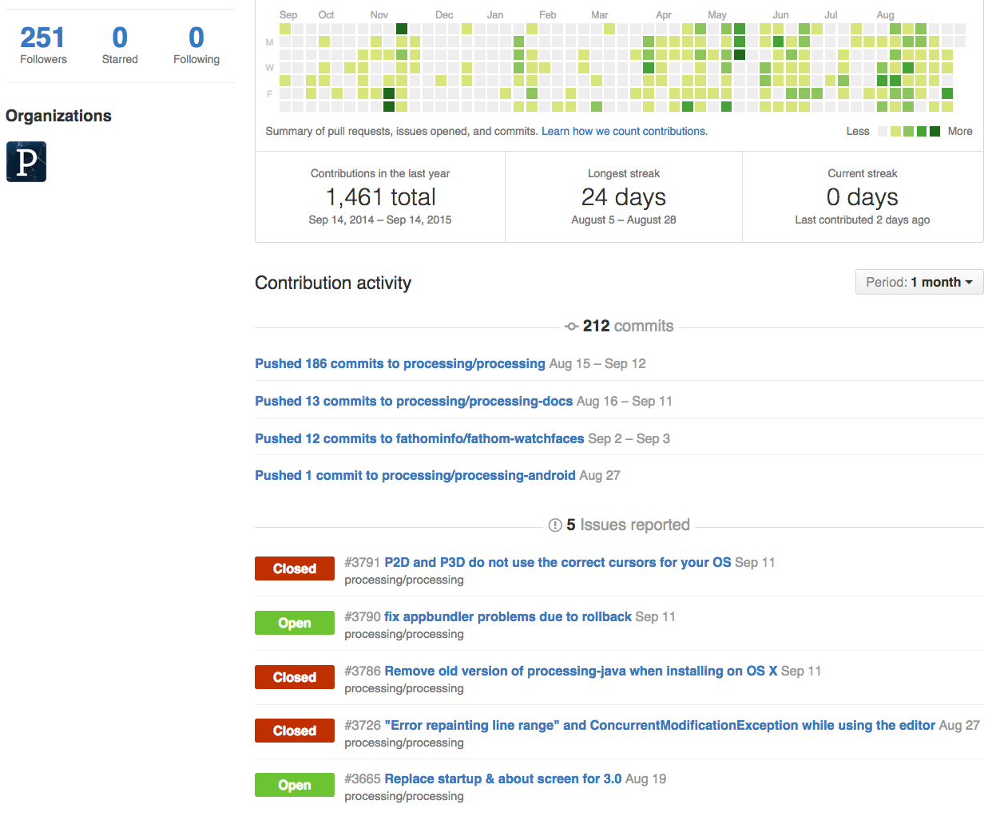
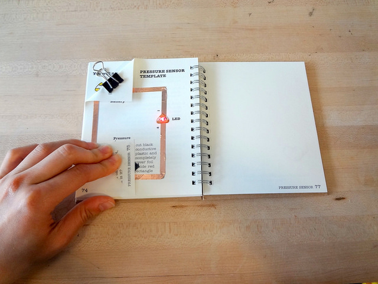
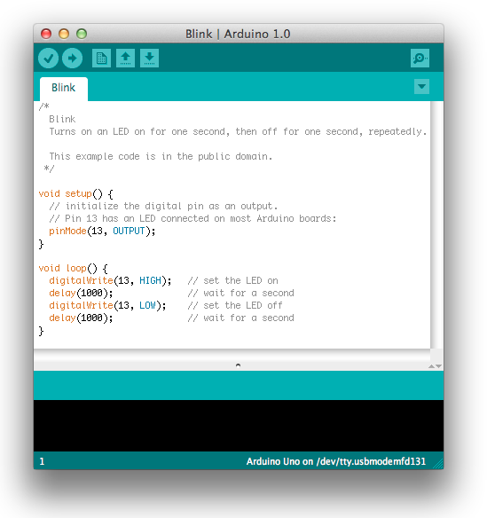
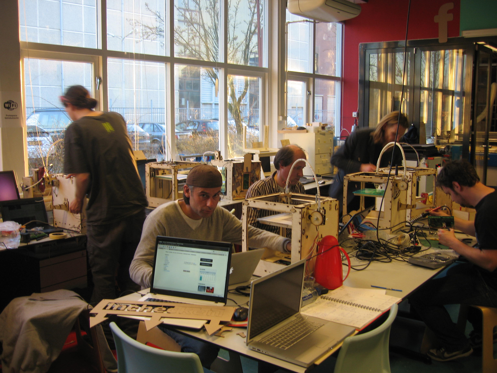

# Εισαγωγή

> Τα πράγματα που πρέπει να κάνεις, τα μαθαίνεις κάνοντάς τα.
Αριστοτέλης (384 - 322 π.Χ.)

## Οργάνωση

Το βιβλίο είναι χωρισμένο σε δύο μέρη και έξι κεφάλαια τα οποία μπορούν και να λειτουργήσουν αυτόνομα στην περίπτωση που ο αναγνώστης έχει ήδη τις αντίστοιχες γνώσεις από προηγούμενη εκπαίδευση.

Το πρώτο μέρος του βιβλίου, "Προγραμματισμός Συστημάτων Διάδρασης" (Programming System Interaction) περιγράφει τα βασικά δομικά στοιχεία και τις τεχνικές του προγραμματισμού της διάδρασης και επομένως απευθύνεται σε όσους έχουν λίγες γνώσεις στις επιμέρους περιοχές, αλλά και στον συνδυασμό τους. Για αυτόν τον σκοπό, το πρώτο μέρος του βιβλίου παρέχει τις βασικές γνώσεις τόσο από την πλευρά του προγραμματισμού όσο και από την πλευρά της διάδρασης. Ο αναγνώστης του πρώτου μέρους του βιβλίου θα μάθει πρώτα από όλα για τη σημασία της διάδρασης σε ένα μεγάλο πλήθος ανθρώπινων και κοινωνικών δραστηριοτήτων. Ακόμη, θα διαβάσει για τη βασική ανθρωποκεντρική διαδικασία σχεδιασμού συσκευών. Επιπλέον, θα διαβάσει για τα θεμελιώδη αρχέτυπα (λογισμικό και υλικό) που απαιτούνται για τον ανθρωποκεντρικό προγραμματισμό της διάδρασης. Με άλλα λόγια, αυτό το μέρος του βιβλίου παρέχει τις πρώτες θεμελιώδεις γνώσεις της ειδικής περιοχής του προγραμματισμού της διάδρασης. Συνολικά, το πρώτο μέρος προσφέρει μια σύνθεση από τις βασικές γνώσεις από τις περιοχές του προγραμματισμού συστημάτων και του ανθρωποκεντρικού σχεδιασμού.

Το δεύτερο μέρος, "Αρχιτεκτονική Συστημάτων Διάδρασης" (System Interaction Architecture) περιγράφει τα δομικά συστατικά του προγραμματισμού της διάδρασης με αναφορά στις βασικές ανθρώπινες ιδιότητες και στις βασικές τεχνολογίες που είναι διαθέσιμες στις συσκευές χρήστη. Για αυτό τον σκοπό, θα διαβάσει για τις τεχνικές και διαδικασίες που χρησιμοποιούνται για κατασκευή μιας διεπαφής με τον χρήστη. Ο αναγνώστης του δεύτερου μέρους θα μάθει πως να προγραμματίζει για όλες τις βασικές ανθρώπινες δυνατότητες, όπως είναι η αφή, τα δάκτυλα, τα χέρια, και η κίνηση. Ακόμη, θα διαβάσει πως μπορεί να προγραμματίσει την ανάδραση από την πλευρά του ΗΥ. Επιπλέον, θα διαβάσει για τα βασικά υλικά που απαιτούνται όταν έχουμε περισσότερους από έναν ανθρώπους και συσκευές. Τέλος, θα διαβάσει για την ποικιλία και τη ρευστότητα της κατανόησης που έχουμε για τη φύση της διάδρασης ανθρώπου-υπολογιστή. Συνοπτικά, το δεύτερο μέρος προσφέρει τις θεμελιώδεις γνώσεις για μπορέσει κάποιος να προγραμματίσει στην πράξη τη διάδραση ανθρώπου-υπολογιστή ανεξάρτητα από την κλίμακα και το πεδίο εφαρμογής.

Όλα τα κεφάλαια του βιβλίου περιγράφουν τις σύνθετες δομές του προγραμματισμού της διάδρασης με αναφορά στις ανθρώπινες και κοινωνικές δραστηριότητες. Αρχικά, ο αναγνώστης μαθαίνει για τις βασικές ατομικές μορφές προγραμματισμού της διάδρασης. Στη συνέχεια, θα διαβάσει για την περίπτωση που έχουμε συλλογικές μορφές διάδρασης. Ακόμη, θα μάθει για τον προγραμματισμό της διάδρασης για τη δημοφιλή περίπτωση του κινητού και φορετού υπολογισμού. Τέλος, θα διαβάσει για τις φαινομενικά αόρατες αλλά πολύ σημαντικές περιπτώσεις του προγραμματισμού της διάδρασης για την περίπτωση του περιβάλλοντος και οικοσυστήματος συσκευών. Συνοπτικά, όλα τα κεφάλαια προσφέρουν σταδιακά τις σύνθετες γνώσεις στον προγραμματισμό της διάδρασης, ώστε να μπορέσει κάποιος να ενορχηστρώσει περισσότερο πολύπλοκα συστήματα.

Όλα τα κεφάλαια του βιβλίου περιέχουν ερευνητικές και εμπορικές μελέτες περίπτωσης που αναφέρονται σε πρακτικές εφαρμογές του προγραμματισμού της διάδρασης σε τομείς με διαχρονικό ενδιαφέρον. Με αυτόν τον τρόπο το βιβλίο παρέχει πρακτικές γνώσεις από έναν μεγάλο, σε πλήθος και ποικιλία, αριθμό εφαρμογών του προγραμματισμού της διάδρασης στην καθημερινότητα και στην εργασία. Ο αναγνώστης θα μάθει για την πρώτη εφαρμογή του προγραμματισμού της διάδρασης στην εργασία και στην παραγωγικότητα. Ακόμη, θα διαβάσει για το πως ο προγραμματισμός της διάδρασης μπορεί να εφαρμοστεί σε πρακτικές και χρήσιμες εφαρμογές στις περιοχές της μάθησης και της επιστημονικής έρευνας. Επιπλέον, θα διαβάσει για τις πολύ σημαντικές εφαρμογές του προγραμματισμού της διάδρασης στην υγεία και στο περιβάλλον. Τέλος, θα μάθει για τις πολύ δημοφιλείς εφαρμογές του προγραμματισμού της διάδρασης στη ψυχαγωγία, στον πολιτισμό, και στις τέχνες. Συνοπτικά, οι μελέτες περίπτωσης προσφέρουν προχωρημένες γνώσεις για να μπορέσει κάποιος να λύσει πρακτικά προβλήματα που αντιμετωπίζει στην εργασία του, ανεξάρτητα από τον τομέα (π.χ., εκπαίδευση, ψυχαγωγία, εργασία) και το είδος (π.χ., έρευνα, βιομηχανία).

## Πολυτροπικό και πολυμεσικό περιεχόμενο

Ένα βιβλίο που περιγράφει τον προγραμματισμό της διάδρασης δεν θα μπορούσε σε καμία περίπτωση να βασιστεί μόνο στις λέξεις και τις προτάσεις. Εκτός από το κείμενο, η ηλεκτρονική έκδοση του βιβλίου συνοδεύεται από ένα μεγάλο αριθμό από εικόνες και κυρίως βίντεο, τα οποία προσφέρουν την καλύτερη δυνατή περιγραφή για ένα φαινόμενο δυναμικό. Ακόμη, η ηλεκτρονική έκδοση του βιβλίου περιέχει παραδείγματα έτοιμου κώδικα για τη διάδραση, τα οποία στις περισσότερες περιπτώσεις μπορούν να εκτελεστούν στον φυλλομετρητή. Στις περιπτώσεις που απαιτείται ειδικό υλικό για την εκτέλεση του κώδικα, τότε υπάρχουν οι αντίστοιχες προδιαγραφές. Σκόπιμα, ο κώδικας είναι διαθέσιμος μόνο στην ηλεκτρονική έκδοση του βιβλίου, γιατί, αν το παρελθόν είναι καλός οδηγός, τότε είναι σχεδόν σίγουρο ότι ο αρχικός κώδικας της πρώτης έκδοσης σε λίγα χρόνια δεν θα μπορεί να εκτελεστεί στις μελλοντικές πλατφόρμες. Αν και για πρακτικούς λόγους έχουμε επιλέξει κάποιες γλώσσες προγραμματισμού, κάποιες βιβλιοθήκες, και αντίστοιχο υλικό στο οποίο εκτελούνται, η περιγραφή εστιάζει περισσότερο στα κριτήρια επιλογής τεχνολογιών, παρά στις λεπτομέρειες της κάθε τεχνολογίας, που είναι βέβαιο ότι θα αλλάξουν ή θα εξαφανιστούν.

## Διδακτική προσέγγιση

### Μαθησιακοί στόχοι

Η παραδοσιακή διδακτική προσέγγιση, κυρίως σε θέματα προγραμματισμού και λιγότερο σε θέματα διάδρασης, βασίζεται στην αντίστοιχη πρακτική των σπουδών στα μαθηματικά και στη μηχανική. Στην πράξη δηλαδή οι σπουδαστές της νέας περιοχής του προγραμματισμού της διάδρασης καλούνται να δώσουν λύσεις σε πολύ καλά ορισμένα προβλήματα, τα οποία υποτίθεται ότι έχουν πολύ καλά ορισμένες λύσεις. Αν και οι άνθρωποι έχουν μια πολύ χρήσιμη φυσική τάση να αντιμετωπίζουν κάθε τι καινούριο με βάση τις γνώσεις που έχουν για κάτι παλιότερο που του μοιάζει, η χρησιμότητα αυτής της τάσης λειτουργεί αρνητικά όταν το καινούριο τελικά δεν ήταν τόσο ίδιο με αυτό που υποτίθεται ότι του έμοιαζε.

Πράγματι, ο προγραμματισμός της διάδρασης δεν είναι καθόλου όμοιος με τις φαινομενικά συγγενείς περιοχές, κυρίως γιατί τα προβλήματά του ούτε καλά ορισμένα είναι, ούτε αντικειμενικές λύσεις έχουν. Για παράδειγμα, κοιτάζοντας αναδρομικά ορισμένες εμπορικές (π.χ., Napster, Skype) ή επιστημονικές (π.χ., NLS, Xerox Star) καινοτομίες θα δυσκολευτούμε να βρούμε προγενέστερά τους βιβλία ή έστω τις ενότητες των βιβλίων που περιγράφουν τον προγραμματισμό της διάδρασης για κάτι που μοιάζει έστω και λίγο με αυτά. Ειδικά οι δημοφιλείς εφαρμογές της εποχής του δικτύου, όπως μια μηχανή αναζήτησης που βασίζεται κυρίως στους συνδέσμους ανάμεσα στις σελίδες παρά στο περιεχόμενο τους (π.χ., Google) και ένα κοινωνικό δίκτυο ανθρώπων (π.χ., Facebook), ποτέ δεν αποτέλεσαν περιεχόμενο κάποιου βιβλίου παρά την τεχνολογική απλότητα τους. Με δεδομένη λοιπόν τη διαφορετικότητα των βασικών ιδιοτήτων του προγραμματισμού της διάδρασης (π.χ., ανοιχτός ορισμός του προβλήματος και της λύσης), έχουμε επιλέξει και μια διδακτική προσέγγιση που θεωρούμε περισσότερο συμβατή για την παρουσίασή του.

### Εποικοδομητικές δραστηριότητες

Το γεγονός ότι ο προγραμματισμός της διάδρασης είναι ένα ανοικτό πρόβλημα από τη φύση του δεν σημαίνει ότι θα αφήσουμε τον αναγνώστη σε αχαρτογράφητα νερά κατά την ανάγνωση του βιβλίου. Αντίθετα, το βιβλίο συνοδεύεται από ένα σύνολο δραστηριοτήτων που στηρίζουν την προσπάθεια κατανόησης του περιεχομένου. Για να το πετύχουμε αυτό, οι δραστηριότητες προσφέρουν κίνητρα για την μελέτη σχετικών βιβλιογραφικών πηγών και προτρέπουν την επαναχρησιμοποίηση έτοιμων παραδειγμάτων εφαρμογών ανοικτού κώδικα, οπότε η ανάπτυξη σχετικά πολύπλοκων εφαρμογών μετατρέπεται περισσότερο σε κατανόηση της λειτουργίας ενός έτοιμου παραδείγματος μέσα από τον πειραματισμό και των σταδιακών αλλαγών σε ένα κύκλο γόνιμης δοκιμής και σφάλματος. Για τη διευκόλυνση της εκτέλεσης των δραστηριοτήτων, το βιβλίο προσφέρει ένα παράρτημα όπου περιγράφρονται με πρακτικό τρόπο οι βασικοί πυλώνες του προγραμματισμού της διάδρασης: η κατανοήση των αναγκών του χρήστη (user needs) και η αναζήτηση εναλλακτικών (ideation), η κατασκευή διαδραστικού πρωτοτύπου υψηλής πιστότητας (high fidelity interactive prototype), και η αξιολόγηση με χρήστες (user evaluation).

Εκτός από τις δραστηριότητες, κάθε κεφάλαιο του βιβλίου συνοδεύεται και από μελέτες περίπτωσης που είναι χωρισμένες στις κατηγορίες της εμπορικής και της ερευνητικής μελέτης περίπτωσης. Οι ερευνητικές μελέτες περίπτωσης αναφέρονται σε κλασικά επιστημονικά άρθρα, τα οποία είτε έθεσαν σημαντικά ερευνητικά ερωτήματα είτε προσφέρουν μια διαχρονική ερευνητική μέθοδο, που μπορεί να εφαρμοστεί σε νέα ερωτήματα που προκύπτουν συνεχώς. Οι εμπορικές μελέτες περίπτωσης αφορούν και αυτές κλασικά προϊόντα, τα οποία δημιούργησαν μια νέα κατηγορία και άλλαξαν τόσο την αγορά, που η αγορά έχει το όνομα τους. Τόσο οι ερευνητικές όσο και οι εμπορικές μελέτες περίπτωσης είναι στενά δεμένες με τα θεωρητικά θέματα της περιοχής του αντίστοιχου κεφαλαίου, έτσι ώστε ο αναγνώστης να μπορεί άμεσα να δει την πιθανή χρησιμότητα που θα έχει να κατανοήσει την ύλη.

### Αξιολόγηση και χαρτοφυλάκιο έργων

Το παραδοσιακό πτυχίο τριτοβάθμιας εκπαίδευσης περιλαμβάνει έναν μέσο όρο βαθμολογίας καθώς και μια συνοδευτική αναλυτική βαθμολογία για πολλά επιμέρους μαθήματα, τα οποία συνιστούν τους δομικούς λίθους, ώστε ο απόφοιτος να μπορεί δυνητικά να κτίσει πάνω σε αυτούς έναν ικανό αριθμό έργων. Επιπλέον, σε πολλές σχολές -ειδικά σε αυτές των μηχανικών- εκτός από τις βαθμολογίες των μαθημάτων υπάρχει και η βαθμολογία της διπλωματικής εργασίας, η οποία αποτελεί ένα έργο πιο σύνθετο από τις εργασίες των μαθημάτων. Αυτή η δομή αξιολόγησης και πιστοποίησης του έργου του εκπαιδευόμενου είναι πολύ ευέλικτη και πρακτική όταν γνωρίζουμε με μεγάλη ακρίβεια σε ποιον κλάδο της οικονομίας θα εργαστεί. Στην σύγχρονη διεπιστημονική και ρευστή οικονομία απαιτείται ένας περισσότερο συμβατός τρόπος πιστοποίησης, ο οποίος θα είναι πιο ζωντανός, θα βασίζεται περισσότερο στα ομαδικά έργα, και θα περιέχει λεπτομέρειες για την ποιοτική και ποσοτική συνεισφορά του εργαζόμενου.

Σε μια οικονομία, όμως, που βρίσκεται σε συνεχή μετασχηματισμό, η δομή αυτή όχι μόνο δεν είναι βέλτιση αλλά ίσως γίνεται και εμπόδιο, αφού δεν μας δίνει πληροφορίες για τις αξίες που μας ενδιαφέρουν, όπως είναι η ποιότητα και η συνεισφορά σε συνεργατικά έργα. Επιπλέον, η παραδοσιακή δομή μας δίνει πάρα πολλές ποσοτικές πληροφορίες για τον εκπαιδευόμενο, όπως την προσωπική του επίδοση σε επιμέρους μαθήματα, χωρίς όμως να μας δίνει ποιοτικές πληροφορίες, όπως το είδος της εργασίας που έκανε και την προσπάθεια για βελτίωση. Παράλληλα, μας δίνει πάρα πολύ λίγες πληροφορίες για τον εκπαιδευόμενο σχετικά με τη δυνατότητά του να συνεργάζεται σε ομάδες με άλλους για την ολοκλήρωση ενός κοινού έργου, καθώς και για τις λεπτομέρειες της συνεισφοράς του στο πλαίσιο της ομάδας. Τόσο οι πιθανοί εργοδότες, όσο και οι πιθανοί συνεργάτες ενδιαφέρονται πλέον περισσότερο για την πρακτική συνεισφορά που έχει να επιδείξει κάποιος στα πλαίσια της εργασίας σε ομάδα.

Ο ακρογωνιαίος λίθος της αξιολόγησης στα παραδοσιακά συστήματα της τριτοβάθμιας εκπαίδευσης είναι οι τελικές γραπτές εξετάσεις. Σε πολλές περιπτώσεις, οι τελικές γραπτές εξετάσεις δίνουν τον τελικό βαθμό για ένα μάθημα σε συνδυασμό με άλλες δραστηριότητες όπως είναι οι ασκήσεις και οι εργασίες. Αυτό όμως που πρέπει να εξετάσουμε είναι η ίδια η πρακτική των γραπτών εξετάσεων και η συμβατότητά της με τις δεξιότητες που είναι χρήσιμες στον εκπαιδευόμενο και ευρύτερα στην κοινωνία και στην οικονομία. Η αξία των τελικών γραπτών εξετάσεων είναι διαχρονική, τουλάχιστον αναφορικά με την ανάγκη να γίνεται μια συνοπτική επανάληψη στις δραστηριότητες που έχουν προηγηθεί στη διάρκεια του εκπαιδευτικού χρόνου, και μια καταγραφή των συμπερασμάτων από αυτές. Στην σύγχρονη κοινωνία και οικονομία, η πρακτική των τελικών γραπτών εξετάσεων μπορεί να βελτιωθεί με περισσότερη έμφαση στη συνεργασία και στην άμμιλα (π.χ., hackathon), καθώς και με τη δημιουργία μιας τελικής αναφοράς, η οποία θα μπει στο χαρτοφυλάκιο (portfolio) με τα έργα του εκπαιδευόμενου.

## Δραστηριότητες και Εργαλεία Υλικού και Λογισμικού

Επιπλέον, καθώς ο αναγνώστης διατρέχει τις ενότητες του κάθε κεφαλαίου οι δραστηριότητες του παρέχουν μια γνωστική σκαλωσιά, ώστε να μπορέσει να κατανοήσει τη νέα ύλη. Για αυτόν τον σκοπό, οι δραστηριότητες κάθε κεφαλαίου δεν είναι στεγανά, αλλά έχουν σημαντικές επικαλύψεις (σχεδόν επαναλήψεις αναφορικά με τη μεθοδολογία τους) και εξελίσσονται γραμμικά μέσα από τις αντίστοιχες ενότητες, έτσι ώστε ο αναγνώστης να μπορεί να φτάσει στο τέλος του κεφαλαίου έχοντας φτιάξει βήμα-βήμα ένα πολύπλοκο έργο προγραμματισμού της διάδρασης. Η πρακτική αυτή θα του δώσει την αυτοπεποίθηση να δοκιμάσει τις δεξιότητες που έχει αποκτήσει σε ένα πρόβλημα του πεδίου που ακόμη δεν έχουμε σκεφτεί ή που ακόμη δεν υπάρχει. Η δεξιότητα να εντοπίζουμε μια ανάγκη που δεν καλύπτεται είτε καθόλου είτε αρκετά καλά, και μετά να προσπαθούμε να την καλύψουμε είναι μια διαδικασία που βασίζεται στον διάλογο ανάμεσα στους χρήστες και στον κατασκευαστή ενός προϊόντος ή υπηρεσίας. Ο διάλογος αυτός πρέπει να έχει διάρκεια και προφανώς δεν βασίζεται μόνο στη συζήτηση, αλλά κυρίως στις δοκιμές και από τις δύο πλευρές.

Οι περισσότερο αποτελεσματικές προσεγγίσεις του προγραμματισμού της διάδρασης βασίζονται στις εφαρμοσμένες και στις δημιουργικές τέχνες. Για παράδειγμα, ομάδες προγραμματιστών συναντιούνται τακτικά για να φτιάξουν μουσική και βιντεοπαιχνίδια. Αυτού του είδους οι ομάδες πολύ σπάνια αυτοχαρακτηρίζονται ως προγραμματιστές της διάδρασης, αφού ούτε δεσμεύονται από μια τεχνική, ούτε από κάποιο εργαλεία ("αρκεί να κάνουν τη δουλειά"), στην πράξη όμως οι περισσότερες από τις λειτουργίες που κάνουν καθώς και οι ρόλοι τους εμπίπτουν σε αυτήν ακριβώς την περιοχή. Στην παραδοσιακή οικονομική οργάνωση, οι ομάδες εργασίας συνήθως οργανώνονται ιεραρχικά (από πάνω προς τα κάτω) και αυτή η δραστηριότητα συνήθως συμβαίνει μέσα σε μεγάλες εταιρικές δομές. Αντίθετα, οι ομάδες εργασίας αυτής της περιοχής συνήθως προκύπτουν οργανικά είτε σε ανεπίσημες συναντήσεις είτε σε μικρές και βραχύβιες εταιρείες. Αν και η υπόσταση αυτών των ομάδων εργασίας είναι συνήθως εφήμερη, δεν ισχύει το ίδιο με το αποτέλεσμα του έργου τους, το οποίο είτε σαν πηγαίος κώδικας είτε σαν ιδέα, θα εμπνεύσει τις επόμενες ομάδες εργασίας που θα δημιουργήσουν μια παραλλαγή ή επέκτασή του.

Αντίστοιχα με τα κίνητρα των παραπάνω ομάδων, λοιπόν, η διδακτική αυτού του βιβλίου βασίζεται σε ανοιχτά προβλήματα από τις εφαρμοσμένες τέχνες, όπως είναι τα βιντεοπαιχνίδια, και αντίστοιχα με τον αγνωστικισμό απέναντι στα εργαλεία των παραπάνω ομάδων, το βιβλίο αυτό στις υποενότητες των δραστηριοτήτων προτρέπει τη χρήση πολυμεσικών εργαλείων οπτικού προγραμματισμού (π.χ., Scratch, Kodu, TouchDevelop, App Inventor), τα οποία είναι κατάλληλα ακόμη και για την πρωτοβάθμια εκπαίδευση, δηλαδή για κάποιον που δεν ξέρει καθόλου προγραμματισμό.

Στη συνέχεια οι δραστηριότητες προχωράνε σταδιακά (π.χ., Processing) σε περισσότερο προχωρημένα εργαλεία λογισμικού (π.χ., OpenFrameworks) και υλικού (π.χ., Arduino, RaspberryPi) τα οποία θα επιτρέψουν προς τα τελευταία κεφάλαια στον αναγνώστη όχι μόνο να μάθει για νέες συσκευές και οικοσυστήματα διάδρασης, αλλά να οραματιστεί και να κατασκευάσει μόνος του δημιουργικές λύσεις σε νέα προβλήματα, που δεν μας είναι ακόμη γνωστά ή αρκετά σημαντικά. Άλλωστε, η εμβύθιση του αναγνώστη σε μια φιλοσοφία περισσότερο δημιουργική και παραγωγική παρά καταναλωτική είναι από τους βασικούς διδακτικούς στόχους αυτού του βιβλίου.

## Εφαρμογή στην εκπαίδευση

Η οργάνωση του βιβλίου επιτρέπει την εφαρμογή του σε πολλές διαφορετικές περιπτώσεις εκπαιδευτικής πρακτικής. Αρχικά, το σύνολο του βιβλίου μπορεί να αποτελέσει τη βάση για τη διδασκαλία ενός μαθήματος στον προγραμματισμό της διάδρασης. Ακόμη, επιλογές από τα κεφάλαια μπορούν να χρησιμοποιηθούν ως μελέτες περίπτωσης σε ένα μάθημα προγραμματισμού ΗΥ. Επιπλέον, επιλογές από κεφάλαια και δραστηριότητες μπορούν να χρησιμοποιηθούν ως εργαστηριακές ασκήσεις σε ένα μάθημα διάδρασης ανθρώπου-υπολογιστή. Σε κάθε μια από τις παραπάνω περιπτώσεις ο αναγνώστης μπορεί να διαλέξει μόνο μερικά από τα κεφάλαια ή τα βασικά μέρη του βιβλίου, τα οποία έχουν οργανωθεί έτσι ώστε να λειτουργούν αυτόνομα, χωρίς την προϋπόθεση γνώσεων από τα προηγούμενα κεφάλαια. Επίσης, τα κεφάλαια και οι δραστηριότητες έχουν οργανωθεί έτσι ώστε να μπορούν να πραγματοποιηθούν σε χρόνο μιας εβδομάδας ή δέκα συνολικά (μελέτη, εργασίες) ωρών. Με αυτόν τον τρόπο, το βιβλίο εξυπηρετεί και τη διοικητική πλευρά της εκπαίδευσης, η οποία απαιτεί μια οργανωμένη διαδικασία και εκτίμηση χρόνου, έτσι ώστε να μπορούν να αποδοθούν οι αντίστοιχες διδακτικές μονάδες που διευκολύνουν την κινητικότητα των εκπαιδευομένων. Τέλος, αν και το βιβλίο έχει γραφτεί κυρίως για την τριτοβάθμια εκπαίδευση και γενικότερα τη μεταλυκειακή εκπαίδευση, σίγουρα μπορεί να χρησιμοποιηθεί και στη δευτεροβάθμια όταν έχει υπάρξει προηγούμενη επαφή με περιβάλλοντα προγραμματισμού.

Το περιεχόμενο του βιβλίου και το συνοδευτικό ηλεκτρονικό περιεχόμενο είναι αναγκαία -αλλά όχι και ικανή- συνθήκη για την κατανόηση και την ανάπτυξη δεξιοτήτων στον προγραμματισμό της διάδρασης. Οπως θα δούμε στα επόμενα κεφάλαια, είναι τόσες πολλές οι επιμέρους δεξιότητες (π.χ., κατανόηση ανθρώπινων αναγκών, υλικού και λογισμικού υπολογιστή, βιομηχανικού σχεδιασμού, επιχειρηματικού πλάνου-business plan) και τόσο λεπτή η ισορροπία ανάμεσά τους, που απαιτείται ατομική και συνεργατική πρακτική εξάσκηση σε πολλές διαφορετικές δραστηριότητες της περιοχής. Για τον σκοπό αυτό, η παραδοσιακή εκπαιδευτική οργάνωση που βασίζεται σε μια αίθουσα διδασκαλίας με τον δάσκαλο στην ηγεσία της ομάδας των μαθητών και όλους μαζί να παρακολουθούν και να επαναλαμβάνουν με προκαθορισμένη ακρίβεια ασκήσεις που περιγράφει το βιβλίο δεν είναι συμβατή με τις απαιτούμενες δεξιότητες του προγραμματισμού της διάδρασης. Η παραδοσιακή οργάνωση της βιομηχανικής παραγωγής (π.χ., αγροτική και βιομηχανική παραγωγή, υπηρεσίες) είναι πράγματι πολύ συμβατή με την παραδοσιακή οργάνωση της εκπαίδευσης, αλλά για την περίπτωση του προγραμματισμού της διάδρασης απαιτείται ένας διεπιστημονικός εκπαιδευτικός χώρος με ευέλικτη δομή και διαδικασίες.

Η κατανόηση του περιεχομένου μπορεί να γίνει πιο σωστά εάν υπάρχει και ένα εργαστήριο τύπου hacker-/maker-space. Τα εργαστήρια αυτά συνοψίζουν την ουσία του προγραμματισμού της διάδρασης γιατί παρέχουν πρόσβαση σε ένα σύνολο από μέχρι τώρα διακριτά εργαλεία παραγωγής όπως είναι οι υπολογιστές, τα ηλεκτρονικά, οι 3D εκτυπωτές. Η σύνθεση αυτών των διεπιστημονικών εργαλείων είναι απαραίτητη γιατί η ιστορία έχει δείξει ότι ειδικά οι καινοτομικές μορφές διάδρασης βασίζονται σε ένα συνδυασμό τους. Φυσικά, υπάρχουν πολλές αξιόλογες κατασκευές που μπορούν να γίνουν μόνο με λογισμικό, αλλά το λογισμικό (software) συνήθως περιορίζεται από το υλικό (hardware) και την φόρμα (form) της συσκευής που ήδη έχουμε στην διάθεσή μας, και ο μόνος τρόπος να δημιουργήσουμε πραγματικά νέες διαδράσεις είναι ο πειραματισμός με διαφορικό υλικό και φόρμες υπολογιστή. Προφανώς, είναι πολύ δύσκολο ένας μόνο προγραμματιστής της διάδρασης να έχει όλες αυτές τις δεξιότητες, άρα απαιτείται και συνεργασία κατασκευαστών. Επομένως, τα εργαστήρια τύπου makerspace διέπονται από ένα πνεύμα λειτουργίας που ενθαρρύνει τον δημιουργικό πειραματισμό και τη συνεργατική ανάπτυξη.

## Συμπληρωματικά βιβλία

Όπως όλα τα βιβλία, έτσι και αυτό, προσπαθεί να καλύψει ένα κενό στη βιβλιογραφία, το οποίο δεν καλύπτει κάποιο από τα υπάρχοντα βιβλία. Το βασικό κενό της βιβλιογραφίας είναι ότι τα θέματα του προγραμματισμού και τα θέματα τις διάδρασης ανθρώπου-υπολογιστή καλύπτονται σε ξεχωριστά βιβλία. Ο προγραμματισμός της διάδρασης όμως περιλαμβάνει μια μεγάλη σειρά από χρήσιμες γνώσεις οι οποίες είναι πάρα πολλές σε έκταση και βάθος για να αναφερθούν στα επιμέρους γενικά βιβλία. Από τη μια πλευρά ένα από τα πολλά γενικά βιβλία προγραμματισμού θα πρέπει να περιγράψει τις πολύ βασικές δομές και διαδικασίες του προγραμματισμού ενός ΗΥ, οπότε δεν θα μείνει χώρος για καλυφθεί ο προγραμματισμός για ένα μεγάλο πλήθος συσκευών χρήστη, οι οποίες έχουν πολλές ιδιαιτερότητες (π.χ., έξυπνο κινητό τηλέφωνο). Από την άλλη πλευρά ένα από τα πολλά βιβλία διάδρασης ανθρώπου-υπολογιστή θα πρέπει να περιγράψει τη βασική οργάνωση και τεχνικές για τον σχεδιασμό της διεπαφής και στις περισσότερες περιπτώσεις δεν θα έχει τον χώρο να περιγράψει κάτι περισσότερο από μια περίπτωση χρήσης που συνήθως εξαντλείται σε αυτήν του επιτραπέζιου ΗΥ ή στις εφαρμογές του δικτύου. Και στις δύο περιπτώσεις βλέπουμε ότι τα υπάρχοντα βιβλία δεν έχουν χώρο να καλύψουν την πολύ ενδιαφέρουσα περίπτωση του προγραμματισμού της διάδρασης για ένα συνεχώς αυξανόμενο σε πλήθος και ποικιλία συσκευών χρήστη. Το βιβλίο αυτό προσπαθεί λοιπόν να περιγράψει την οργάνωση και τις τεχνικές που χρησιμεύουν στον προγραμματισμό συσκευών χρήστη, από τον παραδοσιακό επιτραπέζιο ΗΥ, μέχρι το κινητό και διάχυτο ΗΥ, καθώς και τις περιπτώσεις του φορετού και περιβαλλοντικού ΗΥ.

Ανάλογα με τις γνωστικές ανάγκες και προτιμήσεις του αναγνώστη ίσως να απαιτούνται περισσότερα από ένα βιβλία για να καλυφθεί μια ανάγκη. Για αυτόν το λόγο παραθέτουμε ενδεικτικά μερικά βιβλία που θα μπορούσαν να λειτουργήσουν συμπληρωματικά. Τα βιβλία που προτείνονται συμπληρωματικά είναι οργανωμένα σύμφωνα με το προηγούμενο σκεπτικό, σε βιβλία που βοηθούν στον προγραμματισμό και σε βιβλία που βοηθούν στον σχεδιασμό της διάδρασης ανθρώπου-υπολογιστή αντίστοιχα. Με αυτόν τον τρόπο, τόσο ο εκπαιδευόμενος όσο και ο εκπαιδευτής μπορεί να συνδυάσει αυτό το βιβλίο με ένα άλλο ανάλογα με τις ανάγκες του. Για παράδειγμα, σε ένα εκπαιδευτικό πρόγραμμα προγραμματισμού αυτό το βιβλίο μπορεί να φανεί χρήσιμο ως μελέτες περίπτωσης. Επιπλέον, σε ένα εκπαιδευτικό πρόγραμμα διάδρασης ανθρώπου-υπολογιστή, αυτό το βιβλίο μπορεί να φανεί χρήσιμο ως εργαστηριακό βοήθημα. Τα επιμέρους βιβλία για τη σχεδίαση της διάδρασης και τον προγραμματισμό είναι πολλά και αυξάνονται συνέχεια σε ανταπόκριση της χρησιμότητας των αντίστοιχων γνωστικών περιοχών. Για λόγους ευκολίας παραθέτουμε μόνο μερικά ενδεικτικά και με βασικό κριτήριο τη συμπληρωματικότητα τους με το παρών βιβλίο και όχι με κάποιο άλλο αντικειμενικό κριτήριο ποιότητας.

Οι αναγνώστες που θέλουν να μάθουν περισσότερα για επιμέρους ειδικά θέματα σχετικά με τον προγραμματισμό ή τη διάδραση τότε θα μπορούσαν να το αναζητήσουν σε κάποιο από τα ελληνικά βιβλία του Σπινέλλη (2005) και του Κουτσαμπάση (2011). Στην αγγλική βιβλιογραφία υπάρχουν ακόμη περισσότερες συμπληρωματικές επιλογές ανάμεσα στις οποίες διαλέγουμε τα βιβλία του Noble (2012) και της Sharp (2003). Ακόμη, υπάρχει ένα ελληνικό (Ακουμιανάκης 2006) και μερικά ξενόγλωσσα βιβλία (Olsen 2009, Thimbleby 2007) που ασχολούνται με τα θέματα του προγραμματισμού της διάδρασης. Τα παρακάτω βιβλία έχουν παρόμοια κίνητρα με αυτό το βιβλίο (και έμμεσα επιβεβαιώνουν την ανάγκη για συγγράμματα σε αυτήν την σύνθετη περιοχή), αλλά ο χρόνος της παραγωγής τους δεν επέτρεψε στους συγγραφείς να αντιμετωπίσουν ισότιμα της περιπτώσεις πέρα από τον επιτραπέζιο ΗΥ που φαίνεται να μονοπωλεί το ενδιαφέρον τους.

Σε ένα υψηλότερο επίπεδο αφαίρεσης, δύο βιβλία σχετικά με την ευρύτερη βιομηχανική-επιχειρηματική τοποθέτηση αυτού του βιβλίου είναι αυτά του Von Hippel (1995) και του Christensen (1997). Το πρώτο βιβλίο περιγράφει πως οι νέες τεχνολογίες αν και στην αρχή δεν έχουν την ποιότητα και την αποδοχή από την υπάρχουσα αγορά, σε πολλές περιπτώσεις ικανοποιούν μια μικρή μερίδα πελατών και με συνεχή βελτίωση, όχι μόνο γίνονται καλύτερες από τις προηγούμενα ποιοτικές, αλλά και καλλιεργούν την άνθηση μιας πολύ μεγαλύτερης σε μέγεθος αγοράς από την υπάρχουσα, με αποτέλεσμα η παραδοσιακοί ηγέτες να οδηγούνται πολλές φορές ακόμη και στην πτώχευση. Το ενδιαφέρον σημείο σε αυτό το βιβλίο δεν είναι τόσο η αναμφίβολη ακρίβεια με την οποία περιγράφει τη σχεδόν ντετερμινιστική αποτυχία των παραδοσιακών ηγετών, αλλά η έμφαση που δίνει στην τιμωρία τους, επειδή δεν έδωσαν σημασία στον Δαυίδ. Το αποτέλεσμα στις περισσότερες περιπτώσεις είναι ότι τελικά πολλοί άνθρωποι χάνουν την εργασία τους αφού ένα από τα στοιχεία της καινοτομίας είναι το χαμηλό κόστος. Με άλλα λόγια ο Christensen λέει: "πρόσεξε τις μικρές φθηνές τεχνολογίες, αλλιώς θα τιμωρηθείς". Φυσικά, τόσο σε αυτό, όσο και στα υπόλοιπα κλαδικά βιβλία του προσφέρει συμβουλές για ευκαιρίες και για στρατηγικές και τακτικές αλλαγής, όμως αυτές οι αλλαγές φαίνεται να έχουν κίνητρο περισσότερο τον φόβο για τον κίνδυνο, παρά την ελπίδα για κάτι καλύτερο, το οποίο φυσικά είναι το πιο δύσκολο να βρεθεί και να οριστεί. Επομένως, αν και είναι χρήσιμο να γνωρίζουμε τις απειλές της τεχνολογίας, είναι περισσότερο χρήσιμο να γνωρίζουμε τρόπους που η τεχνολογία μπορεί να αναπτυχθεί σε συνεργασία και όφελος της κοινωνικής δραστηριότητας συνολικά και όχι μόνο ως ανταγωνιστικό πλεονέκτημα.

Από την άλλη πλευρά το βιβλίο του Von Hippel έχει ένα σαφώς πιο αισιόδοξο και παραγωγικό μήνυμα. Αντί να περιγράφει πως θα αποτύχει μια παλιά και αναγνωρισμένη εταιρεία όπως π.χ., η Kodak, περιγράφει πως τόσο οι οργανισμοί όσο και οι άνθρωποι, περισσότερο ή λιγότερο εσκεμμένα, συμμετέχουν σε μια συνεχή παραγωγή νέων ιδεών και προϊόντων. Η συνειδητοποίηση του εκδημοκρατισμού των παραγωγικών μέσων και στόχων σε συνδυασμό με τη διάχυτη πρόσβαση στα ψηφιακά εργαλεία και μέσα σχεδιασμού νέων προϊόντων και υπηρεσιών προβάλει ως ελπίδα για τη μετάβαση στην επόμενη φάση της βιομηχανικής επανάστασης, όπου η βασική ανθρώπινη δραστηριότητα θα μετράται σε όρους δημιουργικής παραγωγής, παρά με όρους ποσοτικής παραγωγής ή κατανάλωσης. Είτε αναζητούμε ιδέες για νέα προϊόντα είτε έχουμε τις προδιαγραφές και προσπαθούμε να τα δημιουργήσουμε, οι διαδικασίες που σχετίζονται με τον προγραμματισμό της διάδρασης είναι και στις δύο περιπτώσεις σημαντικές.

## Σχετικά βιβλία

Αξίζει να αναλύσουμε λίγο περισσότερο τα βιβλία του Νoble, του Olsen, και του Thimbleby, τα οποία σε μια πρώτη ανάγνωση φαίνεται να έχουν ακριβώς το ίδιο αντικείμενο με αυτό το βιβλίο, αλλά σε μια προσεκτικότερη μελέτη έχουν περισσότερες διαφορές παρά ομοιότητες.

Πρώτα, το βιβλίο του Olsen (2009) περιγράφει κυρίως τις γραφικές διεπαφές του επιτραπέζιου ΗΥ, πολλές από τις οποίες έχουν και εφαρμογή σε φορητές συσκευές ή σε μεγάλες οθόνες δωματίου. Παρόλα αυτά, το βιβλίο του Olsen απευθύνεται περισσότερο στον προγραμματιστή που θα υλοποιήσει μια διεπαφή σε εμπορικό περιβάλλον καθώς δίνει μεγάλη έμφαση στις λεπτομέρειες και στις τεχνικές των αντίστοιχων αλγορίθμων. Άρα, το βιβλίο του Olsen είναι ιδανικό για κάποιον προχωρημένο προγραμματιστή που έχει ειδικό ενδιαφέρον για τις γραφικές διεπαφές σε εμπορικό περιβάλλον, και μάλλον είναι το ιδανικό βιβλίο που θα διαβάσει κάποιος αφού τελειώσει το παρόν βιβλίο.

Το βιβλίο του Thimbleby (2007) είναι περισσότερο προσβάσιμο και δεν έχει υψηλές απαιτήσεις αναφορικά με προηγούμενες γνώσεις, ταυτόχρονα όμως ο τρόπος που έχει γραφτεί το καθιστά πολύ ακαδημαϊκό. Για παράδειγμα, ο συγγραφέας του ορίζει ένα νέο συμβολικό πεδίο αναπαράστασης του προγραμματισμού της διάδρασης το οποίο είναι μεν πολύ δυνατό, στην πράξη όμως απαιτεί εξοικείωση που θα κοστίσει πολύτιμο χρόνο στους περισσότερους αναγνώστες που δεν έχουν μπροστά τους ένα ανέμελο εξάμηνο σπουδών. Άρα, είναι ένα ιδανικό βιβλίο για κάποιον που θέλει να προχωρήσει σε περισσότερο ερευνητικές παρά πρακτικές κατευθύνσεις, καθώς και για κάποιον που θέλει και έχει χρόνο να εξερευνήσει σε βάθος τη θεωρία της διάδρασης.

Τέλος, το βιβλίο του Noble (2012) είναι περισσότερο όμοιο με αυτό το βιβλίο από όλα τα άλλα καθώς είναι πολύ προσβάσιμο και δίνει έμφαση στην οπτικοποίηση σε οθόνες, αλλά και σε άλλες διάχυτες συσκευές χρήστη. Ταυτόχρονα όμως, το βιβλίο του Noble απευθύνεται σε σχεδιαστές και καλλιτέχνες που δεν έχουν καμία γνώση προγραμματισμού, επομένως, ένα μεγάλο μέρος του βιβλίου απλά επαναλαμβάνει γνώσεις που είτε είναι γνωστές στους περισσότερους αναγνώστες της τριτοβάθμιας εκπαίδευσης είτε είναι ελεύθερα διαθέσιμες στις ιστοσελίδες των εργαλείων που χρησιμοποιεί.

Επομένως, καταλήγουμε στο συμπέρασμα ότι τα βιβλία του Νoble, του Olsen, και του Thimbleby είναι μεν παρόμοια με αυτό το βιβλίο, αλλά ταυτόχρονα πολύ διαφορετικά, γιατί απευθύνονται είτε σε διαφορετικά επίπεδα αναγνώστη (π.χ., το βιβλίο του Olsen σε προχωρημένους προγραμματιστές, πιθανόν ακόμη και σε επαγγελματίες) είτε σε αναγνώστες με διαφορετικά κίνητρα (π.χ., το βιβλίο του Noble σε καλλιτέχνες και σχεδιαστές, ενώ αυτό του Thimbleby σε ακαδημαϊκό κοινό). Η παραπάνω ανάλυση δείχνει ότι υπάρχει ένα κενό, ακόμη και στη διεθνή βιβλιογραφία, στο θέμα του προγραμματισμού της διάδρασης με ένα εισαγωγικό βιβλίο που δεν προϋποθέτει πολλές προηγούμενες γνώσεις, αλλά και δεν έχει στενές προσδοκίες για τον χρόνο που θα αφιερώσει ή τον σκοπό που θα έχει ο αναγνώστης.

Τέλος, πέρα από τα παραπάνω βιβλία που συμπληρώνουν το παρόν βιβλίο ως προς τις ανάγκες του αναγνώστη και του εκπαιδευτικού, υπάρχει και μια μικρή αλλά περιεκτική λίστα στο τέλος από σχετικά βιβλία που έχουν επηρεάσει τη συγγραφή αυτού του βιβλίου. Ακόμη, κάθε κεφάλαιο προσφέρει μια μικρή συνεκτική λίστα από βιβλία με σχετικό περιεχόμενο για το αντίστοιχο κεφάλαιο. Επιπλέον, η ηλεκτρονική έκδοση του βιβλίου περιέχει τόσο ενημερωμένη βιβλιογραφία, όσο και συνδέσμους προς ηλεκτρονικές πηγές.

## Σχετική βιβλιογραφία

Christensen, C.M. (1997). The Innovator's Dilemma: When New Technologies Cause Great Firms to Fail. Harvard Business Press

[Hackathon](https://en.wikipedia.org/wiki/Hackathon)

Mitra, S., & Dangwal, R. (2010). Limits to self‐organising systems of learning—the Kalikuppam experiment. British Journal of Educational Technology, 41(5), 672-688.

Noble, J. (2012). Programming Interactivity. O'Reilly.

Olsen, D. R. (2009) Building Interactive Systems: Principles for Human-Computer Interaction. Cengage Learning.

Sharp, H. (2003). Interaction design. Wiley.

Thimbleby, H. (2007). Press On:Principles of Interaction Programming. MIT Press

Von Hippel, E. (1995). Democratizing Innovation. Oxford University Press

Ακουμιανάκης, Δ. (2006). Διεπαφή χρήστη - υπολογιστή: Μια σύγχρονη προσέγγιση, Κλειδάριθμος

Παναγιώτης Κουτσαμπάσης (2011). Αλληλεπίδραση ανθρώπου-υπολογιστή: Αρχές, μέθοδοι και παραδείγματα, Κλειδάριθμος

Διομήδης Σπινέλλης (2005). Ανάγνωση κώδικα: Η προοπτική του ανοικτού λογισμικού, Κλειδάριθμος
